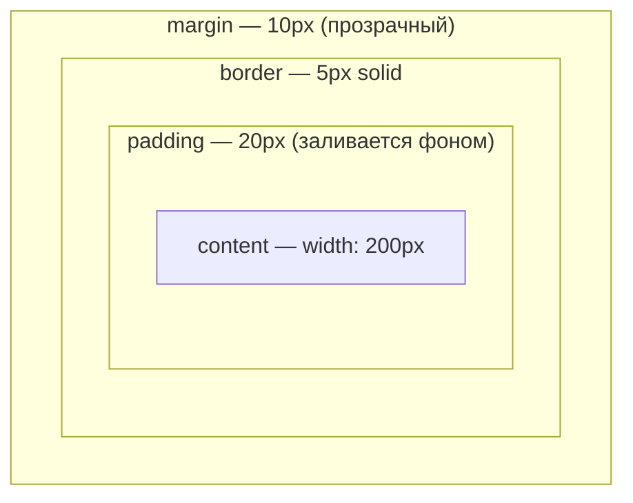

# Box Model в CSS

Каждый элемент на странице — это прямоугольная коробка, устроенная по одинаковой схеме из четырёх слоёв: **content → padding → border → margin**. Понимание box model — база для любой вёрстки: без неё невозможно предсказать реальный размер элемента на странице.

## Слои коробки

- **content** — само содержимое (текст, картинка), размер задаётся `width`/`height`
- **padding** — внутренний отступ между содержимым и границей, фон элемента заливает и его
- **border** — граница коробки: толщина, стиль, цвет
- **margin** — внешний отступ до соседних элементов, прозрачный, в фон элемента не входит

```css
.box {
  width: 200px;
  padding: 20px;
  border: 5px solid #333;
  margin: 10px;
}
```

## Схема



## box-sizing: content-box vs border-box

По умолчанию (`content-box`) `width`/`height` описывают только **content**. Реальная ширина на экране = `width + padding*2 + border*2`.

```
content-box:  width: 200px → на экране 200 + 40 + 10 = 250px
```

`border-box` включает padding и border внутрь заданной `width`/`height` — реальная ширина на экране остаётся ровно 200px.

```css
* {
  box-sizing: border-box;
}
```

Именно поэтому почти все CSS-сбросы (resets) ставят `border-box` глобально — это делает расчёт размеров интуитивным: "я сказал 200px — значит, будет 200px", независимо от паддингов и рамок.

## Margin collapse

Отдельная особенность **margin**, которой нет у padding/border — соседние **вертикальные** margin'ы соседних блочных элементов схлопываются в один, равный большему из двух, а не складываются.

```html
<div style="margin-bottom: 20px">A</div>
<div style="margin-top: 30px">B</div>
<!-- Расстояние между A и B = 30px, а не 50px -->
```

Margin collapse не работает для `display: flex`/`grid`-контейнеров и их прямых детей — там margin'ы ведут себя предсказуемо, без схлопывания.

## Карточки

- Из каких четырёх слоёв состоит box model элемента?
- Чем `box-sizing: border-box` отличается от `content-box`?
- Что произойдёт с реальной шириной элемента `width: 200px; padding: 20px` при `content-box` и при `border-box`?
- Что такое margin collapse и когда он не применяется?
