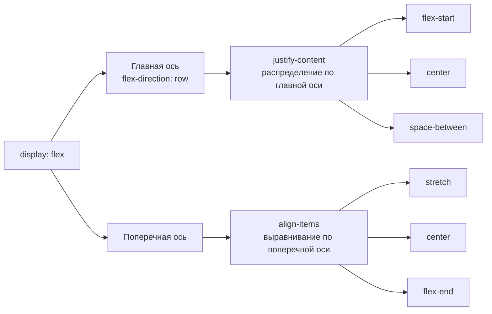

# CSS Flexbox

Flexbox (Flexible Box Layout) — модель раскладки CSS, предназначенная для распределения элементов вдоль **одной оси**: горизонтальной (строка) или вертикальной (колонка). Идеально подходит для навигации, карточек, форм и любых компонентов, где нужно выравнивание.

## Основные понятия

**Flex-контейнер** — родительский элемент с `display: flex`.  
**Flex-элементы** — прямые дочерние элементы контейнера.  
**Главная ось** — направление, заданное `flex-direction` (по умолчанию: горизонталь).  
**Поперечная ось** — перпендикулярна главной.

```css
.container {
  display: flex;
  flex-direction: row;         /* row | column | row-reverse | column-reverse */
  justify-content: center;     /* выравнивание по главной оси */
  align-items: stretch;        /* выравнивание по поперечной оси */
  flex-wrap: nowrap;           /* перенос строк: nowrap | wrap */
  gap: 16px;                   /* отступ между элементами */
}
```

## justify-content

| Значение | Описание |
|----------|----------|
| `flex-start` | Элементы в начале оси (по умолчанию) |
| `flex-end` | Элементы в конце оси |
| `center` | Элементы по центру |
| `space-between` | Равные промежутки между элементами, края вплотную |
| `space-around` | Равные промежутки вокруг каждого элемента |
| `space-evenly` | Абсолютно равные промежутки |

## align-items

| Значение | Описание |
|----------|----------|
| `stretch` | Растянуть до высоты контейнера (по умолчанию) |
| `flex-start` | По началу поперечной оси |
| `flex-end` | По концу поперечной оси |
| `center` | По центру поперечной оси |
| `baseline` | По базовой линии текста |

## Свойства flex-элементов

```css
.item {
  flex-grow: 1;       /* занять доступное пространство (0 — не расти) */
  flex-shrink: 1;     /* сжиматься при нехватке места (0 — не сжиматься) */
  flex-basis: auto;   /* начальный размер до распределения пространства */
  flex: 1;            /* сокращение: flex: 1 1 0 — равномерное распределение */
  align-self: center; /* переопределить align-items для одного элемента */
  order: 2;           /* порядок отображения (по умолчанию: 0) */
}
```

## Практические примеры

**Центрирование по горизонтали и вертикали:**

```css
.centered {
  display: flex;
  justify-content: center;
  align-items: center;
  height: 100vh;
}
```

**Навигационная панель:**

```css
.navbar {
  display: flex;
  justify-content: space-between;
  align-items: center;
  padding: 0 24px;
}
```

**Адаптивная сетка карточек:**

```css
.cards {
  display: flex;
  flex-wrap: wrap;
  gap: 16px;
}
.card {
  flex: 1 1 280px; /* минимум 280px, растут равномерно */
}
```

## Схема



## Карточки

- Как работает Flexbox и что делает justify-content?
- Чем justify-content отличается от align-items?
- Что делает свойство flex: 1 у дочернего элемента?
- Как отцентрировать элемент по горизонтали и вертикали через Flexbox?
- Что такое flex-wrap и когда его использовать?
