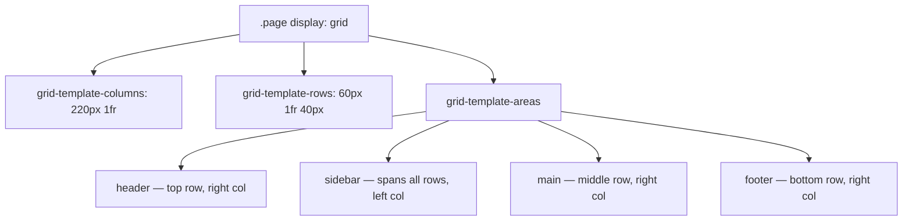

# CSS Grid

CSS Grid — двумерная система вёрстки: в отличие от Flexbox, который выстраивает элементы **в одну линию** (строку или колонку), Grid одновременно управляет **строками и колонками**.

## Базовый синтаксис

```css
.layout {
  display: grid;
  grid-template-columns: 200px 1fr 1fr;
  grid-template-rows: auto 1fr auto;
  gap: 16px;
}
```

`fr` — доля свободного пространства. `1fr 1fr` делит оставшееся место пополам, `200px 1fr 1fr` — сначала фиксированная колонка, остаток делится между двумя гибкими.

## Именованные области

Самая наглядная часть Grid — раскладка через `grid-template-areas`:

```css
.page {
  display: grid;
  grid-template-columns: 220px 1fr;
  grid-template-rows: 60px 1fr 40px;
  grid-template-areas:
    "sidebar header"
    "sidebar main"
    "sidebar footer";
}

.header  { grid-area: header; }
.sidebar { grid-area: sidebar; }
.main    { grid-area: main; }
.footer  { grid-area: footer; }
```

Название области визуально повторяет форму макета — читать CSS почти так же просто, как смотреть на картинку.

## Схема



## Grid vs Flexbox

| | Flexbox | Grid |
|---|---|---|
| Измерения | Одномерный (строка **или** колонка) | Двумерный (строки **и** колонки) |
| Когда использовать | Навигация, тулбары, выравнивание элементов в ряд | Общий layout страницы, карточные сетки |
| Управление | Элементы определяют размер контейнера | Контейнер определяет сетку заранее |

На практике их комбинируют: Grid — для макета всей страницы, Flexbox — для выравнивания содержимого внутри отдельных блоков сетки.

## repeat() и auto-fit

Частая задача — адаптивная сетка карточек без media queries:

```css
.cards {
  display: grid;
  grid-template-columns: repeat(auto-fit, minmax(220px, 1fr));
  gap: 20px;
}
```

`auto-fit` подставляет столько колонок по 220px+, сколько влезает в ширину контейнера, и растягивает их на оставшееся место — без единого `@media`.

## Карточки

- Чем CSS Grid отличается от Flexbox?
- Что означает `1fr` в `grid-template-columns`?
- Как раскладка задаётся через `grid-template-areas`?
- Как сделать адаптивную сетку карточек через `repeat(auto-fit, minmax(...))` без media queries?
