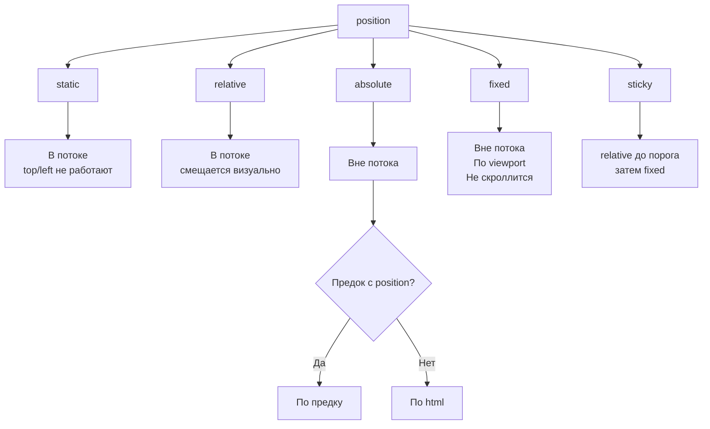

# CSS Positioning — Позиционирование элементов

Позиционирование определяет, как элемент размещается на странице и взаимодействует с потоком документа. Одна из самых частых тем на собеседованиях junior-разработчиков.

## Значения свойства position

### static
Значение по умолчанию. Элемент в обычном потоке. Свойства `top/right/bottom/left` и `z-index` **не работают**.

```css
div { position: static; } /* то же, что без position */
```

### relative
Элемент **остаётся в потоке** — занимает своё место, соседи его не замечают. Но визуально смещается относительно исходного положения.

```css
.badge {
  position: relative;
  top: -4px; /* поднимается вверх */
  left: 8px;
}
```

Golden rule: `relative` часто ставят родителю, чтобы стать точкой отсчёта для `absolute`-потомка.

### absolute
Элемент **вырывается из потока** — не занимает места. Позиционируется относительно ближайшего предка с `position ≠ static`. Если такого нет — относительно `<html>`.

```css
.parent  { position: relative; }

.tooltip {
  position: absolute;
  top: 0;
  right: 0; /* прижат к верхнему правому углу .parent */
}
```

### fixed
Элемент **вырывается из потока** и позиционируется по **viewport**. Не двигается при прокрутке страницы.

```css
.cookie-banner {
  position: fixed;
  bottom: 0;
  left: 0;
  width: 100%;
}
```

### sticky
Гибрид `relative` и `fixed`. Ведёт себя как `relative`, пока не достигнет порога при прокрутке — тогда «приклеивается». Работает только внутри родителя.

```css
.table-header {
  position: sticky;
  top: 0;
  background: white;
}
```

## z-index и контекст наложения

`z-index` работает только у элементов с `position ≠ static`. Чем больше значение, тем выше элемент.

```css
.overlay { position: fixed; z-index: 99;  }
.modal   { position: fixed; z-index: 100; }
```

## Схема



## Частые ошибки

| Проблема | Причина | Решение |
|---|---|---|
| `absolute` не там, где ожидается | У родителя нет `position: relative` | Добавить `position: relative` родителю |
| `sticky` не работает | У предка `overflow: hidden/auto` | Убрать `overflow` с предка |
| `z-index` не работает | У элемента `position: static` | Установить `position: relative` |

## Карточки
- Чем отличаются position: relative, absolute, fixed и sticky?
- Почему `position: sticky` может не работать?
- Что такое контекст наложения и как работает `z-index`?
- Как позиционировать элемент в правом верхнем углу родителя?
