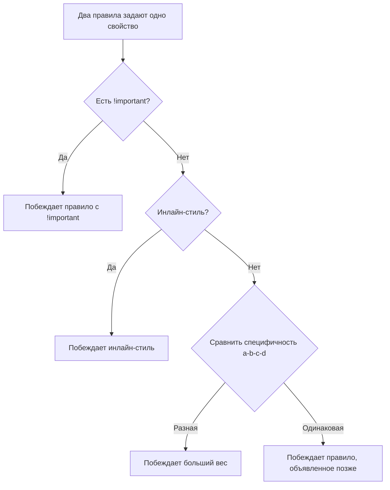

# Специфичность CSS (Specificity)

Специфичность (specificity) — это алгоритм, по которому браузер решает, какое из конкурирующих CSS-правил применить к элементу, если несколько селекторов задают одно и то же свойство.

## Как считается вес селектора

Специфичность представляется как вектор из четырёх чисел `(a, b, c, d)`:

- **a** — инлайн-стиль (`style="..."`)
- **b** — id-селекторы (`#header`)
- **c** — классы, атрибуты, псевдоклассы (`.btn`, `[type="text"]`, `:hover`)
- **d** — теги и псевдоэлементы (`div`, `::before`)

Сравнение идёт слева направо: сначала сравнивают `a`, при равенстве — `b`, потом `c`, потом `d`. Это **не** сложение в десятичной системе — 10 классов не победят 1 id.

```css
div p                  /* 0-0-0-2 */
.article p             /* 0-0-1-1 */
#main .article p       /* 0-1-1-1 — побеждает благодаря id */
style="color: red"     /* 1-0-0-0 — побеждает всё выше */
```

## Порядок разрешения конфликтов

1. `!important` — побеждает всё (используйте как крайний случай)
2. Инлайн-стили
3. Специфичность селектора (id > class > tag)
4. Порядок объявления — при равной специфичности выигрывает правило, идущее позже в CSS

## Схема



## Частые ошибки junior-разработчиков

**Злоупотребление `!important`**

```css
/* Плохо — теперь любое переопределение требует ещё один !important */
.button { color: red !important; }
```

**Излишне специфичные селекторы**

```css
/* Плохо — трудно переопределить, ломает переиспользование */
body div#app .container ul li a.link { color: blue; }

/* Лучше — плоская структура на классах */
.link { color: blue; }
```

**Смешение id и классов для стилизации**

id лучше оставить для JS-хуков и якорей (`#section-1`), а стили вешать на классы — это даёт предсказуемую и низкую специфичность.

## Карточки

- Как считается специфичность CSS-селекторов?
- Что побеждает при конфликте: `.class.class.class` или `#id`?
- Почему стоит избегать `!important`?
- Что происходит при равной специфичности двух правил?
