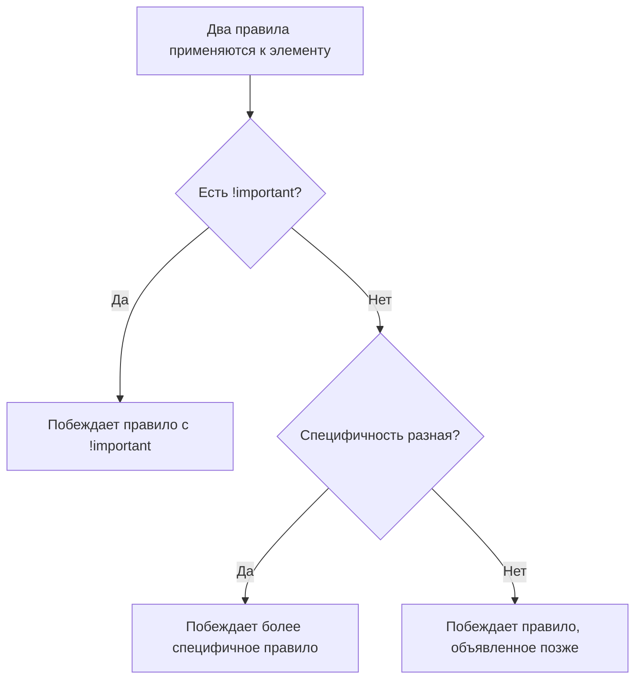

# Специфичность (Specificity) в CSS

Когда несколько правил CSS применяются к одному элементу, браузер выбирает победителя по **специфичности** — числовому весу селектора. Чем выше вес, тем выше приоритет.

## Как считается вес

Специфичность — это четыре числа, сравниваемые слева направо:

| Уровень | Что считается | Вес |
|---|---|---|
| a | inline-стиль (`style="..."`) | 1000 |
| b | ID-селекторы (`#id`) | 100 |
| c | классы, атрибуты, псевдоклассы (`.class`, `[attr]`, `:hover`) | 10 |
| d | теги, псевдоэлементы (`div`, `::before`) | 1 |

```css
div p { color: black; }                 /* 0,0,0,2  = 2   */
.article p { color: green; }            /* 0,0,1,1  = 11  */
#main .article p { color: blue; }       /* 0,1,1,1  = 111 */
p { color: red !important; }            /* побеждает почти всегда */
```

## Порядок разрешения конфликтов

1. `!important` — перебивает всё (кроме другого `!important` с бОльшим весом)
2. Более высокая специфичность
3. При равной специфичности — правило, объявленное позже в CSS

## Схема



## Частые ошибки junior-разработчиков

**Злоупотребление ID и !important**

```css
/* Плохо — тяжело переопределить в будущем */
#sidebar .widget .title { color: red !important; }

/* Лучше — используем классы, наращивая специфичность точечно */
.widget-title { color: red; }
```

**Инлайн-стили побеждают классы**

```html
<p class="text-blue" style="color: red;">Текст</p>
<!-- Будет красным — inline всегда весит 1000 -->
```

**Неожиданный порядок в CSS-in-JS / styled-components**

Порядок подключения стилей в бандле тоже влияет на итоговый результат при равной специфичности — не только порядок в файле.

## Карточки

- Как считается специфичность CSS-селектора?
- Что побеждает при конфликте: `.btn:hover` или `#submit`?
- Почему `!important` считается плохой практикой?
- Что происходит при равной специфичности двух правил?
