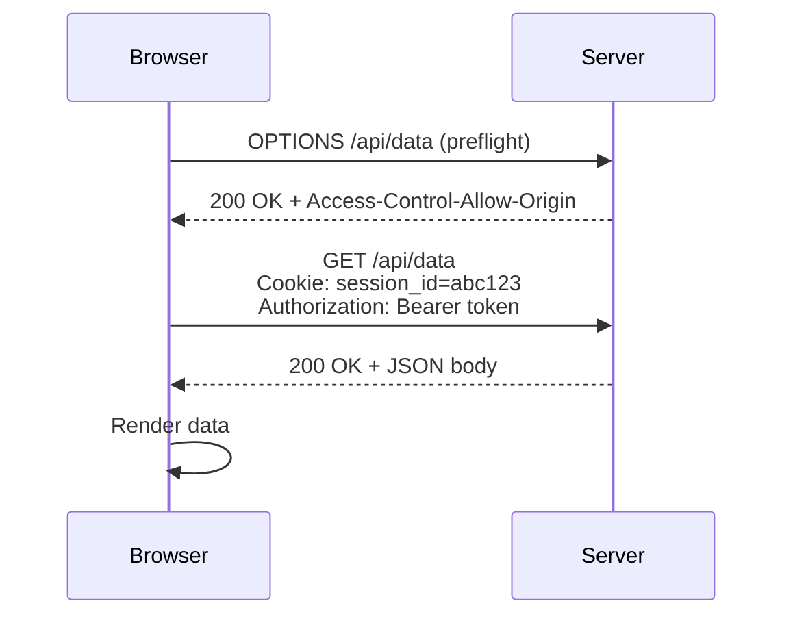

# HTTP: основы протокола

HTTP (HyperText Transfer Protocol) — протокол прикладного уровня для передачи данных в вебе. Работает по модели «запрос — ответ» поверх TCP/IP.

## Структура HTTP-запроса

```
GET /api/users/42 HTTP/1.1
Host: example.com
Authorization: Bearer eyJhbGc...
Content-Type: application/json
```

Каждый запрос состоит из:
- **Метод** — действие (GET, POST, PUT, DELETE...)
- **URL** — адрес ресурса
- **Заголовки (Headers)** — метаданные запроса
- **Тело (Body)** — данные (только для POST/PUT/PATCH)

## Структура HTTP-ответа

```
HTTP/1.1 200 OK
Content-Type: application/json

{"id": 42, "name": "Alice"}
```

## CORS (Cross-Origin Resource Sharing)

Браузер блокирует запросы с другого домена (origin) — это политика Same-Origin Policy. Сервер должен явно разрешить доступ через заголовок:

```
Access-Control-Allow-Origin: https://my-app.com
```

**Preflight-запрос** — перед «сложным» запросом (с заголовками или не-GET) браузер автоматически отправляет `OPTIONS`, чтобы проверить разрешения сервера.

## Cookies

Сервер устанавливает cookie через заголовок `Set-Cookie`. Браузер автоматически прикладывает их к каждому последующему запросу на тот же домен.

```
Set-Cookie: session_id=abc123; HttpOnly; Secure; SameSite=Strict
```

| Флаг | Назначение |
|---|---|
| `HttpOnly` | Запрещает доступ из JS — защита от XSS |
| `Secure` | Передаётся только по HTTPS |
| `SameSite=Strict` | Защита от CSRF-атак |

## Схема



## Карточки
- Из каких частей состоит HTTP-запрос?
- Что такое CORS и зачем нужен preflight-запрос?
- Зачем Cookie нужен флаг HttpOnly?
- Чем отличается флаг Secure от SameSite у Cookie?
