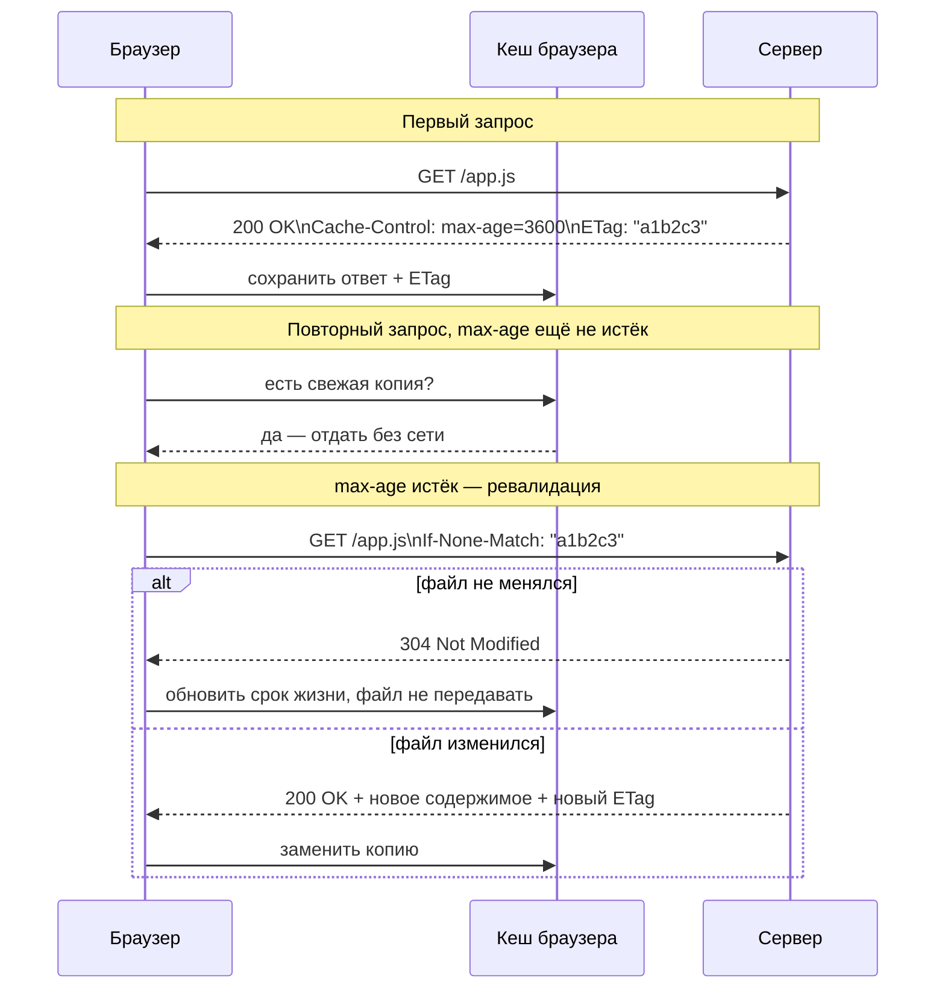

# HTTP-кеширование

**HTTP-кеширование** — механизм, позволяющий браузеру, прокси или CDN хранить копию ответа сервера и переиспользовать её при повторных запросах, не обращаясь к серверу заново. Это снижает нагрузку на сеть, ускоряет загрузку и уменьшает нагрузку на backend.

## Управление кешем: заголовок `Cache-Control`

Сервер указывает, можно ли кешировать ответ и на сколько:

```http
Cache-Control: public, max-age=3600
```

Основные директивы:

| Директива | Смысл |
|---|---|
| `max-age=N` | ответ можно использовать из кеша N секунд без обращения к серверу |
| `public` | можно кешировать где угодно, включая общие прокси/CDN |
| `private` | можно кешировать только в браузере пользователя (не в CDN) |
| `no-cache` | нельзя использовать кеш **без ревалидации** на сервере (не значит «не кешировать»!) |
| `no-store` | вообще не сохранять ответ — ни в каком кеше |
| `immutable` | контент никогда не изменится по этому URL — не проверять заново до истечения `max-age` |

**Частая путаница:** `no-cache` ≠ «не кешировать». `no-cache` разрешает хранить копию, но требует каждый раз спросить сервер «актуальна ли она ещё» перед использованием. Полный запрет кеширования — это `no-store`.

## Ревалидация: `ETag` и `Last-Modified`

Когда срок `max-age` истёк (или стоит `no-cache`), браузер не скачивает файл заново вслепую — он посылает **условный запрос**, и если содержимое не изменилось, сервер отвечает пустым `304 Not Modified` вместо повторной передачи данных.

```http
GET /app.js HTTP/1.1
If-None-Match: "a1b2c3"

HTTP/1.1 304 Not Modified
```

- **`ETag`** — «отпечаток» содержимого файла (хеш). Сервер сравнивает присланный `If-None-Match` с текущим ETag.
- **`Last-Modified`** — дата последнего изменения файла. Браузер присылает её обратно в `If-Modified-Since`.

`ETag` точнее (учитывает содержимое, а не только время), `Last-Modified` проще и дешевле для сервера.

## Cache busting

Если у файла стоит долгий `max-age` (например, `immutable` + год), а его содержимое обновилось — браузер не узнает об этом до истечения срока. Решение: включать хеш содержимого прямо в имя файла.

```
app.js           →  app.a1b2c3d4.js
styles.css       →  styles.9f8e7d6c.css
```

Когда контент меняется, меняется и хеш — значит, меняется имя файла — значит, это **новый URL**, для которого нет закешированной копии, и браузер скачивает его заново. Старое имя файла при этом продолжает жить в кеше сколь угодно долго без риска показать устаревший контент.

## Схема



## Карточки

- В чём разница между `Cache-Control: no-cache` и `no-store`?
- Что такое `ETag` и как работает условный запрос `If-None-Match`?
- Почему браузер при истёкшем `max-age` не всегда скачивает файл заново целиком?
- Зачем в имена файлов (`app.a1b2c3d4.js`) добавляют хеш содержимого?
- Чем директива `private` отличается от `public` в `Cache-Control`?
