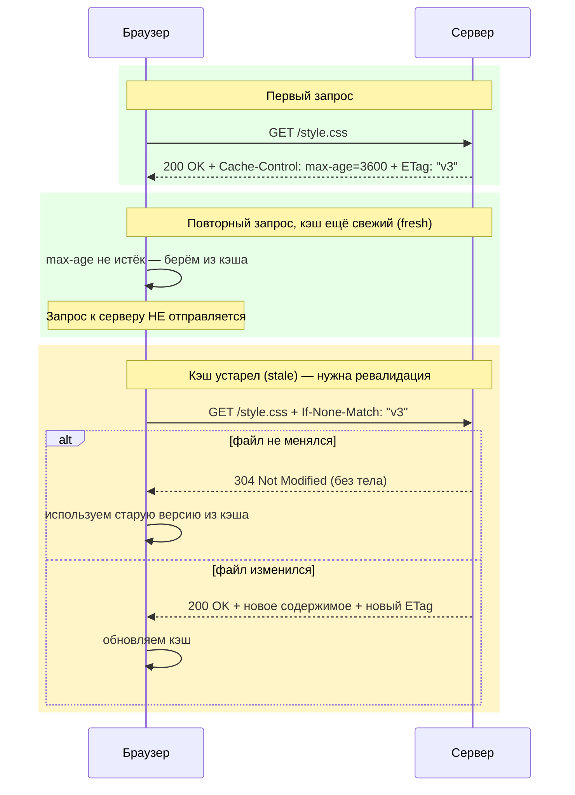

# HTTP-кэширование

**HTTP-кэширование** — механизм повторного использования уже полученных ответов сервера без нового сетевого запроса или с быстрой проверкой «не устарело ли». Это ускоряет загрузку страниц, снижает нагрузку на сервер и экономит трафик пользователя.

## Два вида кэша

- **Приватный кэш (браузер)** — хранит ответы только для одного пользователя. Управляется через `Cache-Control: private`.
- **Общий кэш (CDN, прокси)** — может хранить один и тот же ответ для множества пользователей. Требует `Cache-Control: public`, иначе прокси не имеет права его кэшировать.

## Свежий vs устаревший ответ

Каждый закэшированный ответ проходит через две стадии:

1. **Fresh (свежий)** — пока не истёк `max-age`, браузер отдаёт ответ из кэша **без обращения к серверу вообще**.
2. **Stale (устаревший)** — после истечения `max-age` браузер должен **проверить** актуальность у сервера (revalidation), прежде чем показать закэшированную версию.

```
Cache-Control: max-age=3600       # свежий 1 час, потом revalidation
Cache-Control: no-cache           # ноль "свежести" — ревалидация при КАЖДОМ запросе
Cache-Control: no-store           # вообще не кэшировать (например, банковские данные)
Cache-Control: immutable          # никогда не меняется — не проверять до истечения max-age
```

Частая ошибка новичков: `no-cache` **не значит** «не кэшировать» — значит «кэшировать, но всегда переспрашивать сервер, не изменилось ли». Для полного запрета кэша нужен `no-store`.

## Revalidation: ETag и Last-Modified

Когда кэш устарел, браузер не скачивает ресурс заново целиком — он спрашивает сервер «изменилось ли что-то?».

- **ETag** — «отпечаток» содержимого (хэш или версия). Браузер отправляет `If-None-Match`, сервер сравнивает с текущим ETag.
- **Last-Modified** — дата последнего изменения. Браузер отправляет `If-Modified-Since`.

Если ресурс не изменился, сервер отвечает `304 Not Modified` **без тела ответа** — экономится трафик, хотя сетевой запрос всё же происходит.

## Схема



## Карточки

- Как работает HTTP-кэширование?
- В чём разница между `no-cache` и `no-store`?
- Что делают заголовки `ETag` и `If-None-Match`?
- Чем отличается приватный кэш от общего (shared/CDN)?
- Что означает `304 Not Modified` и когда сервер его возвращает?
