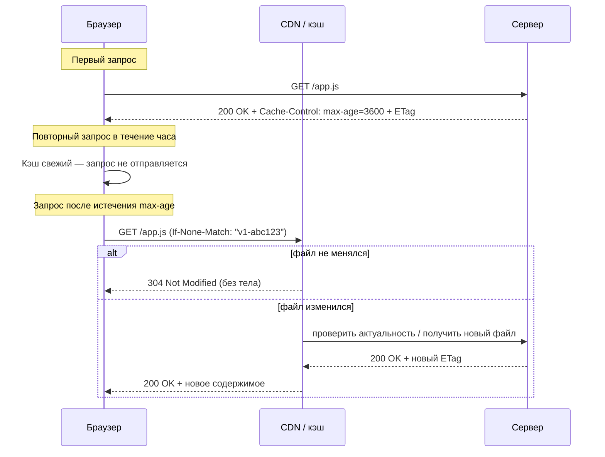

# HTTP-кэширование

**HTTP-кэширование** — механизм, позволяющий браузеру, промежуточным прокси и CDN переиспользовать уже полученный ответ вместо повторного запроса к серверу. Это снижает нагрузку на backend, уменьшает latency и экономит трафик пользователя.

## Два вида кэша

- **Приватный (browser cache)** — хранится в браузере конкретного пользователя.
- **Общий (shared cache)** — CDN, reverse-proxy (Nginx, Varnish), кэш провайдера — общий для многих пользователей.

Заголовок `Cache-Control: private` разрешает кэшировать только в браузере (например, персональные данные), `public` — разрешает и общим кэшам.

## Управляющие заголовки

```
Cache-Control: max-age=3600        # свежий 1 час, повторные запросы не идут на сервер
Cache-Control: no-cache            # можно кэшировать, но каждый раз перевалидировать у сервера
Cache-Control: no-store             # не кэшировать вообще (чувствительные данные)
Cache-Control: public, immutable    # ресурс никогда не изменится по этому URL (файлы с хешем в имени)

ETag: "v1-abc123"                  # «отпечаток» версии ресурса
Last-Modified: Wed, 10 Jul 2026 10:00:00 GMT
```

## Валидация: как сервер экономит трафик, даже если кэш «протух»

Когда `max-age` истёк, браузер не скачивает ресурс заново вслепую — он делает **conditional request**, посылая сохранённый идентификатор версии:

```
GET /app.js HTTP/1.1
If-None-Match: "v1-abc123"
```

Если файл не менялся, сервер отвечает `304 Not Modified` **без тела ответа** — экономится вся полезная нагрузка, передаются только заголовки.

## Cache busting

Проблема: имя файла `app.js` не меняется между релизами, поэтому `max-age=31536000` (год) означает, что пользователи с закэшированной версией не увидят обновление. Решение — включать хеш содержимого в имя файла при сборке:

```
app.a1b2c3.js   → Cache-Control: public, max-age=31536000, immutable
index.html      → Cache-Control: no-cache   (всегда перепроверяется, содержит ссылку на актуальный хеш)
```

Таким образом статику можно кэшировать «навечно», а точку входа (`index.html`) — всегда проверять заново.

## Порядок проверки кэшей

1. **Browser cache** — если есть свежая (`fresh`) копия, запрос вообще не уходит в сеть.
2. **CDN / shared cache** — если браузер не нашёл свежую копию, запрос может быть обслужен ближайшей edge-нодой CDN.
3. **Origin server** — только если ни один уровень кэша не смог ответить.

## Схема



## Карточки

- Как работает HTTP-кэширование и какие заголовки за это отвечают?
- В чём разница между `no-cache` и `no-store`?
- Что происходит при получении ответа `304 Not Modified`?
- Зачем включать хеш содержимого в имя файла (cache busting)?
- Чем отличается приватный кэш браузера от общего кэша CDN?
