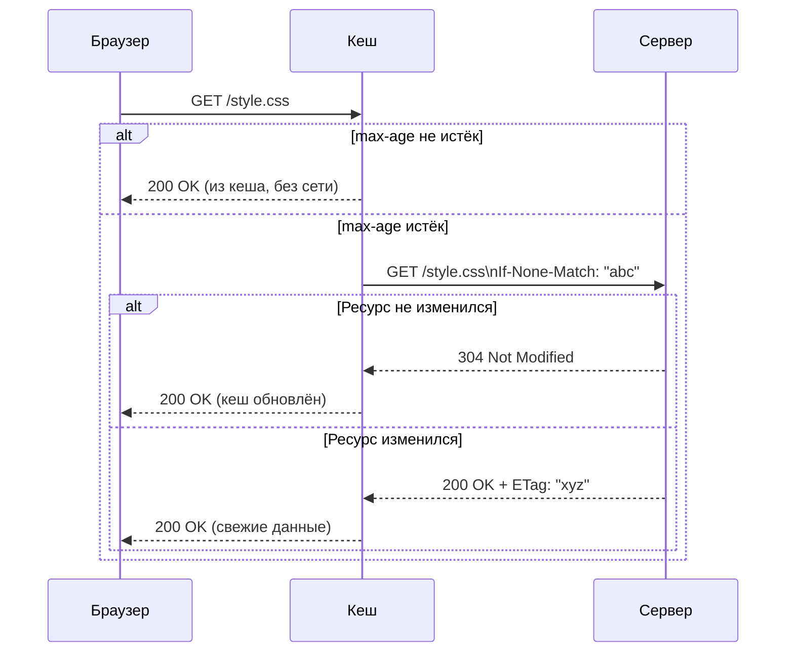

# HTTP Кеширование

HTTP-кеширование — механизм хранения копий ресурсов (HTML, CSS, JS, изображения) ближе к клиенту, чтобы повторно не запрашивать их с сервера. Грамотный кеш снижает задержку, экономит трафик и уменьшает нагрузку на бэкенд.

## Основные заголовки

| Заголовок | Роль |
|---|---|
| `Cache-Control` | Главный заголовок — задаёт правила кеширования |
| `ETag` | Отпечаток версии ресурса (хеш или число) |
| `Last-Modified` | Дата последнего изменения ресурса |
| `Expires` | Устаревший способ задать срок; предпочитай `Cache-Control` |

### Директивы Cache-Control

| Директива | Смысл |
|---|---|
| `max-age=N` | Ресурс свежий N секунд; запрос на сервер не идёт |
| `no-cache` | Всегда проверять актуальность у сервера |
| `no-store` | Никогда не кешировать (пароли, персональные данные) |
| `public` | Можно кешировать в CDN и прокси |
| `private` | Только в браузере пользователя |
| `immutable` | Ресурс никогда не изменится (используй с хешем в URL) |

## Валидация кеша

Когда `max-age` истёк, браузер не удаляет кеш, а спрашивает сервер: «Ресурс изменился?»

Через ETag:
```http
# Запрос
GET /style.css HTTP/1.1
If-None-Match: "v1.2.3"

# Ресурс НЕ изменился — тело не передаётся
HTTP/1.1 304 Not Modified

# Ресурс ИЗМЕНИЛСЯ — новый ETag и тело
HTTP/1.1 200 OK
ETag: "v1.2.4"
```

## Схема



## Стратегия cache-busting

Добавляй хеш содержимого в имя файла при сборке — тогда можно кешировать навсегда:

```
/style.a1b2c3d4.css  →  Cache-Control: max-age=31536000, immutable
```

При каждой сборке URL меняется, браузер загружает новый файл. Старые URL остаются в кеше, но больше не используются.

API-ответы с изменяемыми данными обычно используют `Cache-Control: no-cache` или `no-store`.

## Карточки

- Как работает кеширование HTTP и какие заголовки за него отвечают?
- В чём разница между `no-cache` и `no-store`?
- Что такое `ETag` и зачем он нужен?
- Что такое cache-busting?
