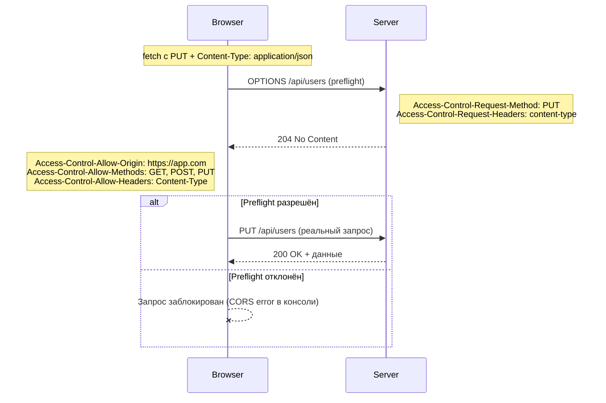

# CORS (Cross-Origin Resource Sharing)

**CORS** — механизм браузера, который решает, может ли скрипт с одного origin (домен + протокол + порт) сделать запрос к серверу на другом origin. Без CORS браузер блокирует такие запросы политикой **Same-Origin Policy (SOP)**.

## Что такое origin

Origin считается разным, если отличается хотя бы один из трёх параметров:

| URL 1 | URL 2 | Один origin? |
|---|---|---|
| `https://app.com` | `http://app.com` | Нет (протокол) |
| `https://app.com` | `https://api.app.com` | Нет (поддомен) |
| `https://app.com:3000` | `https://app.com:8080` | Нет (порт) |
| `https://app.com/a` | `https://app.com/b` | Да (путь не важен) |

## Simple requests vs Preflight

Браузер делит запросы на два типа.

**Simple request** — выполняется напрямую, без предварительной проверки. Условия: метод `GET`/`HEAD`/`POST`, и только "безопасные" заголовки (`Content-Type` из ограниченного списка: `text/plain`, `multipart/form-data`, `application/x-www-form-urlencoded`).

**Preflight request** — если запрос использует `PUT`/`DELETE`/`PATCH`, кастомные заголовки (`Authorization`, `X-Custom-Header`) или `Content-Type: application/json` — браузер сначала отправляет служебный запрос `OPTIONS`, чтобы спросить у сервера разрешения.

## Схема



## Основные заголовки

```
Access-Control-Allow-Origin: https://app.com       // кто может обращаться
Access-Control-Allow-Methods: GET, POST, PUT        // разрешённые методы
Access-Control-Allow-Headers: Content-Type, Authorization
Access-Control-Allow-Credentials: true               // разрешить cookie/авторизацию
Access-Control-Max-Age: 86400                         // кэш preflight-ответа (сек)
```

## Пример настройки на сервере (Node/Express)

```js
app.use((req, res, next) => {
  res.setHeader("Access-Control-Allow-Origin", "https://app.com");
  res.setHeader("Access-Control-Allow-Methods", "GET, POST, PUT, DELETE");
  res.setHeader("Access-Control-Allow-Headers", "Content-Type, Authorization");
  if (req.method === "OPTIONS") return res.sendStatus(204);
  next();
});
```

## Частые ошибки junior-разработчиков

- Пытаться «исправить» CORS-ошибку на **клиенте** — CORS настраивается только на **сервере**, браузер лишь применяет политику.
- Ставить `Access-Control-Allow-Origin: *` вместе с `Access-Control-Allow-Credentials: true` — это запрещено спецификацией, нужен конкретный origin.
- Путать CORS-ошибку с сетевой — при блокировке CORS запрос обычно **доходит до сервера** (кроме отклонённого preflight), но браузер прячет ответ от JS.

## Карточки

- Что такое CORS и зачем он нужен?
- Чем отличается origin от домена?
- Когда браузер отправляет preflight OPTIONS-запрос?
- Можно ли исправить CORS-ошибку только на клиенте?
- Можно ли одновременно использовать Access-Control-Allow-Origin: * и Access-Control-Allow-Credentials: true?
