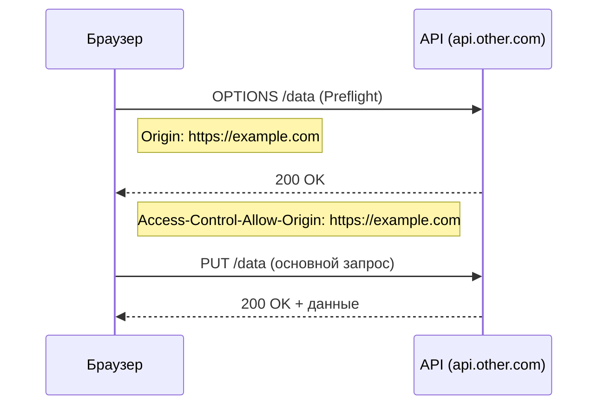

# CORS — Cross-Origin Resource Sharing

CORS (Cross-Origin Resource Sharing) — механизм браузера, контролирующий запросы к другому домену, порту или протоколу. Без разрешения сервера браузер **блокирует** ответ.

## Same-Origin Policy

Браузер по умолчанию разрешает запросы только к тому же **origin**. Origin = протокол + домен + порт.

| URL | Same origin для `https://example.com`? |
|---|---|
| `https://example.com/api` | ✅ да |
| `http://example.com` | ❌ другой протокол |
| `https://api.example.com` | ❌ другой поддомен |
| `https://example.com:3000` | ❌ другой порт |

## Как работает CORS?

Браузер автоматически добавляет заголовок `Origin`. Сервер отвечает заголовком `Access-Control-Allow-Origin`.

### Simple Request
GET, HEAD, POST с обычными заголовками — отправляются напрямую.

### Preflight Request
Перед «сложными» запросами (PUT, DELETE, кастомные заголовки) браузер отправляет **OPTIONS**-запрос для проверки разрешений.

## Схема



## Настройка CORS на сервере

```js
// Express.js
const cors = require('cors');
app.use(cors({
  origin: 'https://example.com',
  methods: ['GET', 'POST', 'PUT', 'DELETE'],
  allowedHeaders: ['Content-Type', 'Authorization'],
}));
```

```python
# Django (django-cors-headers)
CORS_ALLOWED_ORIGINS = [
    "https://example.com",
]
```

## Важные заголовки

| Заголовок | Описание |
|---|---|
| `Access-Control-Allow-Origin` | Разрешённые origins (`*` или конкретный) |
| `Access-Control-Allow-Methods` | Разрешённые HTTP-методы |
| `Access-Control-Allow-Headers` | Разрешённые заголовки запроса |
| `Access-Control-Max-Age` | Время кэша preflight в секундах |
| `Access-Control-Allow-Credentials` | Разрешать ли cookies/credentials |

## Карточки
- Что такое CORS и зачем он нужен?
- Чем Simple Request отличается от Preflight?
- Какой заголовок должен вернуть сервер для разрешения CORS?
- Что такое Same-Origin Policy?
- Почему CORS проверяется браузером, а не сервером?
