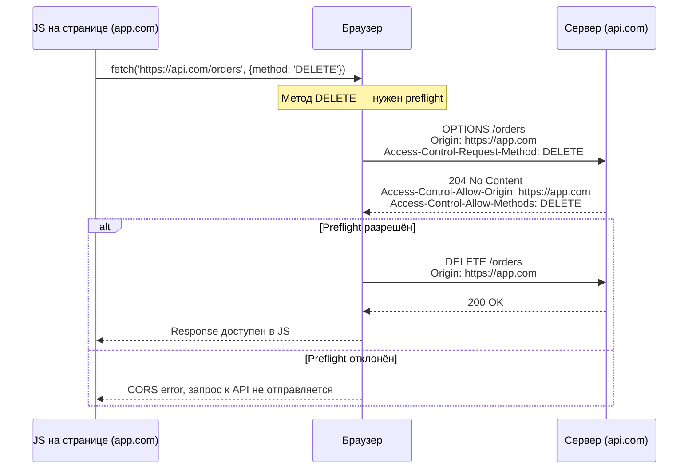

# CORS — как браузер контролирует кросс-доменные запросы

**CORS** (Cross-Origin Resource Sharing) — механизм, который позволяет серверу явно разрешить браузеру читать ответы на запросы с других **origin** (домен + протокол + порт). Без этого механизма браузер применяет **Same-Origin Policy** и блокирует доступ к ответу.

Важно понимать: CORS не блокирует сам запрос — он блокирует **чтение ответа** в JS-коде страницы. Запрос всё равно уходит на сервер и может выполниться (например, изменить данные), просто браузер не отдаст ответ скрипту.

## Origin: что считается "другим доменом"

Origin — это комбинация протокола, хоста и порта. Отличие хотя бы в одной части — уже другой origin:

```
https://app.com          и  http://app.com        → разные origin (протокол)
https://app.com          и  https://api.app.com    → разные origin (хост)
https://app.com:443      и  https://app.com:8443   → разные origin (порт)
```

## Simple requests vs Preflight requests

Не каждый кросс-доменный запрос требует предварительной проверки. Браузер делит запросы на два типа.

**Simple request** — выполняется сразу, без предварительной проверки, если запрос удовлетворяет всем условиям:
- метод `GET`, `POST` или `HEAD`
- заголовки только из "безопасного" списка (`Accept`, `Content-Type` и т.д.)
- `Content-Type` — один из `text/plain`, `multipart/form-data`, `application/x-www-form-urlencoded`

**Preflight request** — если запрос выходит за эти рамки (например, `PUT`, `DELETE`, кастомный заголовок `Authorization`, `Content-Type: application/json`), браузер сначала сам отправляет **OPTIONS**-запрос, чтобы спросить разрешения у сервера.

## Схема


```mermaid
sequenceDiagram
    participant JS as JS на странице (app.com)
    participant Browser as Браузер
    participant API as Сервер (api.com)

    JS->>Browser: fetch('https://api.com/orders', {method: 'DELETE'})
    Note over Browser: Метод DELETE — нужен preflight
    Browser->>API: OPTIONS /orders<br/>Origin: https://app.com<br/>Access-Control-Request-Method: DELETE
    API-->>Browser: 204 No Content<br/>Access-Control-Allow-Origin: https://app.com<br/>Access-Control-Allow-Methods: DELETE
    alt Preflight разрешён
        Browser->>API: DELETE /orders<br/>Origin: https://app.com
        API-->>Browser: 200 OK
        Browser-->>JS: Response доступен в JS
    else Preflight отклонён
        Browser-->>JS: CORS error, запрос к API не отправляется
    end
```

## Ключевые заголовки ответа сервера

```http
Access-Control-Allow-Origin: https://app.com
Access-Control-Allow-Methods: GET, POST, PUT, DELETE
Access-Control-Allow-Headers: Content-Type, Authorization
Access-Control-Allow-Credentials: true
Access-Control-Max-Age: 86400
```

- `Access-Control-Allow-Origin: *` разрешает запросы с любого origin, но **несовместимо** с `Access-Control-Allow-Credentials: true` — при работе с куками/авторизацией нужно явно указывать конкретный origin.
- `Access-Control-Max-Age` — сколько секунд браузер кэширует результат preflight, чтобы не слать OPTIONS перед каждым запросом.

## Частые заблуждения

**"CORS защищает сервер от чужих запросов"** — неверно. CORS — это проверка на стороне **браузера**, защищающая пользователя, а не сервер. Запросы из Postman, curl или другого сервера (Node.js, Python) не подчиняются CORS вообще, потому что это не браузер.

**"Если добавить CORS-заголовки, запрос заработает"** — CORS-заголовки решают только проблему чтения ответа браузером. Если сервер и так публично доступен, атакующий может дергать его напрямую (не через браузер жертвы) — CORS не панацея от небезопасного API, для защиты данных всё равно нужна аутентификация и авторизация на сервере.

**"OPTIONS-запрос долетает до бизнес-логики контроллера"** — обычно preflight обрабатывается middleware/CORS-библиотекой до вашего обработчика и не должен выполнять реальную логику (например, не должен требовать авторизации — иначе preflight будет падать).

## Карточки

- Что такое CORS и почему браузер блокирует запросы?
- Чем отличается simple request от preflight request?
- Почему `Access-Control-Allow-Origin: *` не работает вместе с credentials?
- Защищает ли CORS сервер от прямых запросов не из браузера?
