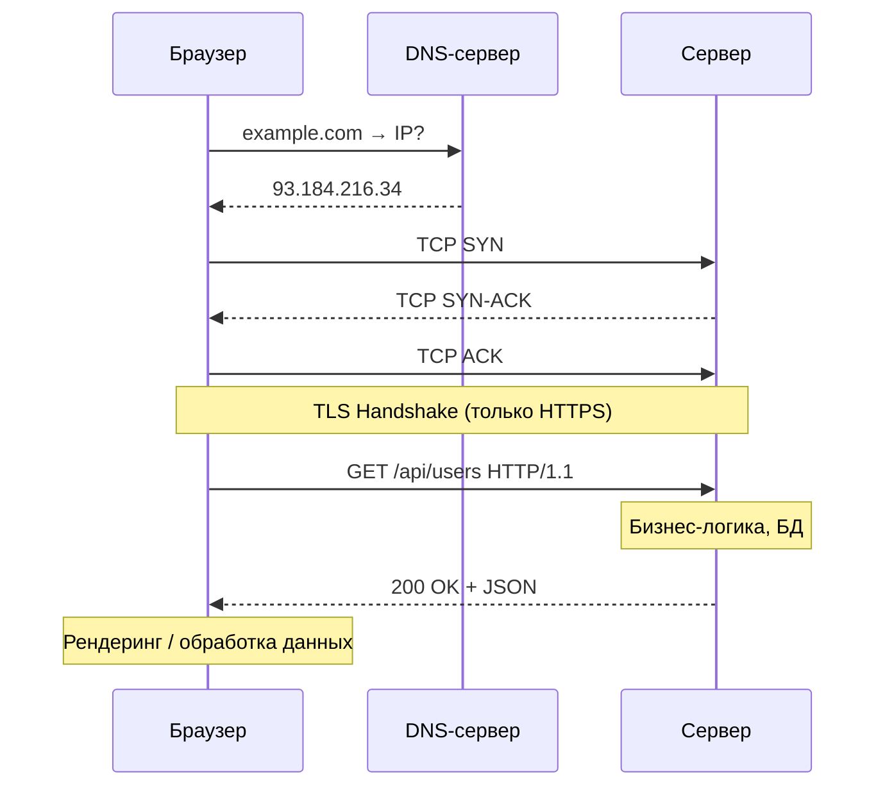

# Жизненный цикл HTTP-запроса

Когда пользователь вводит URL в браузере, происходит цепочка шагов прежде чем он увидит страницу. Понимание этого цикла помогает отлаживать проблемы с производительностью и сетью.

## Этапы запроса

### 1. DNS-разрешение
Браузер переводит доменное имя (`example.com`) в IP-адрес. Порядок поиска: кэш браузера → кэш ОС → DNS-сервер провайдера → корневые серверы.

### 2. TCP-соединение
Устанавливается соединение через **трёхстороннее рукопожатие** (three-way handshake):
- Клиент → **SYN** (хочу соединиться)
- Сервер → **SYN-ACK** (принял, готов)
- Клиент → **ACK** (подтверждаю)

### 3. TLS-рукопожатие (только HTTPS)
Браузер и сервер договариваются о шифровании: сервер присылает сертификат, браузер проверяет подпись у CA, стороны создают сессионный симметричный ключ.

### 4. HTTP-запрос
```http
GET /api/users HTTP/1.1
Host: example.com
Accept: application/json
Authorization: Bearer <token>
```

### 5. Обработка на сервере
Сервер разбирает запрос, выполняет бизнес-логику (БД, кэш, сторонние API) и формирует ответ.

### 6. HTTP-ответ
```http
HTTP/1.1 200 OK
Content-Type: application/json
Cache-Control: max-age=60

{"users": [...]}
```

### 7. Рендеринг (для HTML)
Браузер разбирает HTML → строит DOM → загружает CSS/JS → вычисляет стили → рисует пиксели.

## Схема



## Карточки
- Что такое DNS и зачем он нужен?
- Что такое TCP three-way handshake?
- Чем HTTP отличается от HTTPS?
- Как работает HTTP-кэширование?
- Какие HTTP-заголовки управляют кэшем?
