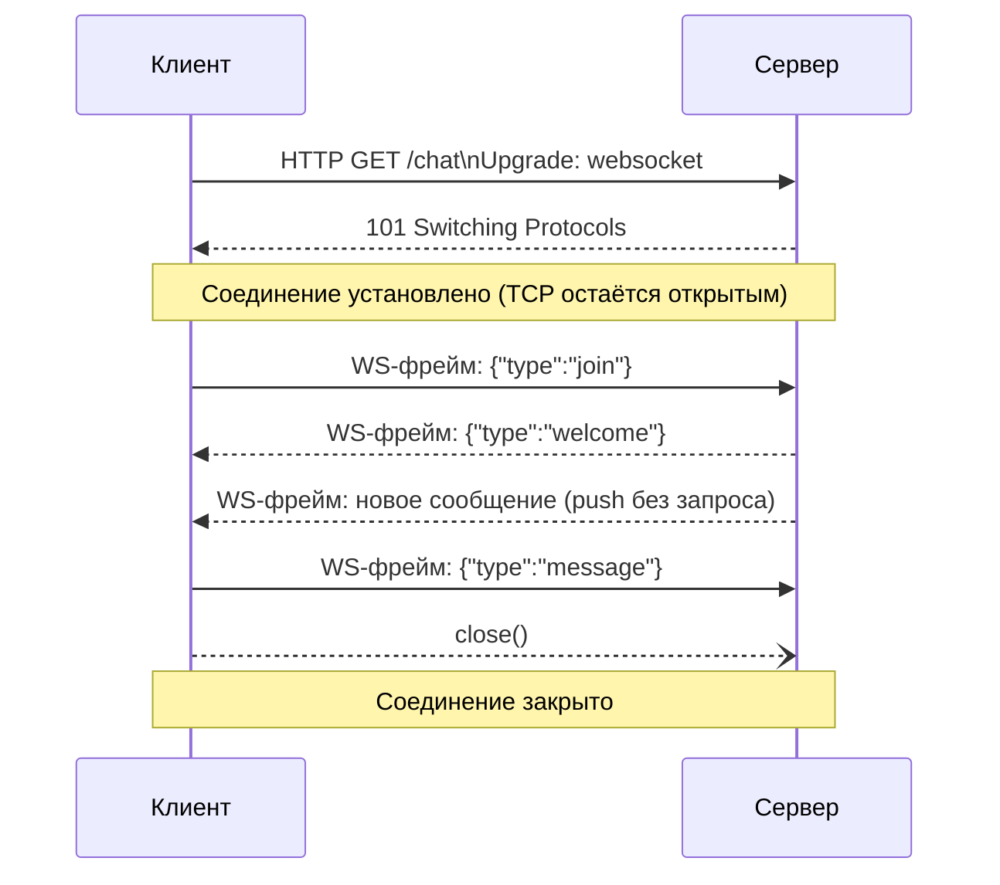

# WebSocket

WebSocket — это протокол связи, который позволяет открыть **постоянное, двустороннее** соединение между браузером и сервером поверх одного TCP-соединения. В отличие от обычного HTTP, где клиент всегда инициирует запрос и ждёт ответ, при WebSocket сервер тоже может в любой момент отправить данные клиенту.

## Как устанавливается соединение

Всё начинается как обычный HTTP-запрос с заголовком `Upgrade: websocket`. Если сервер поддерживает WebSocket, он отвечает `101 Switching Protocols`, и дальше по этому же TCP-соединению данные передаются уже в виде лёгких WebSocket-фреймов, а не HTTP-запросов.

```js
const socket = new WebSocket("wss://example.com/chat");

socket.onopen = () => {
  socket.send(JSON.stringify({ type: "join", room: "general" }));
};

socket.onmessage = (event) => {
  const data = JSON.parse(event.data);
  console.log("Новое сообщение:", data);
};

socket.onerror = (err) => console.error("Ошибка сокета:", err);
socket.onclose = () => console.log("Соединение закрыто");
```

## Схема



## HTTP vs WebSocket

| | HTTP (polling) | WebSocket |
|---|---|---|
| Модель | Запрос → ответ | Постоянное соединение |
| Инициатор | Только клиент | Клиент и сервер |
| Накладные расходы | Заголовки на каждый запрос | Один handshake, дальше лёгкие фреймы |
| Задержка real-time данных | Зависит от интервала опроса | Мгновенная доставка |

## Когда использовать

- Чаты и мессенджеры
- Live-уведомления (лайки, статусы заказов)
- Онлайн-игры с частым обменом состоянием
- Совместное редактирование документов (Google Docs-подобные приложения)

Для менее частых обновлений (раз в несколько секунд/минут) часто достаточно обычного polling или Server-Sent Events (SSE) — WebSocket оправдан, когда нужна низкая задержка в обе стороны.

## Переподключение

Реальные соединения рвутся (сеть, сон устройства, рестарт сервера). На практике WebSocket-клиент почти всегда оборачивают в логику реконнекта с экспоненциальной задержкой:

```js
function connect() {
  const socket = new WebSocket("wss://example.com/chat");
  socket.onclose = () => setTimeout(connect, 1000);
  return socket;
}
```

## Карточки

- Чем WebSocket отличается от обычных HTTP-запросов?
- Как происходит handshake при установке WebSocket-соединения?
- В каких случаях лучше использовать WebSocket, а не обычный polling?
- Почему в реальных приложениях нужна логика переподключения для WebSocket?
