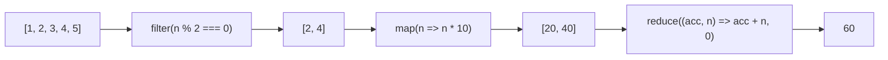

# Методы массивов JavaScript

Массивы в JS имеют богатый набор встроенных методов. Самые важные для junior-разработчика — итерирующие методы: они не изменяют исходный массив и делают код декларативным.

## Основные итерирующие методы

**`map(fn)`** — трансформирует каждый элемент, возвращает новый массив **той же длины**.

**`filter(fn)`** — оставляет только элементы, для которых `fn` вернул `true`.

**`reduce(fn, initial)`** — сворачивает массив в одно значение: число, строку, объект или другой массив.

**`find(fn)`** — возвращает первый подходящий элемент (или `undefined`).

**`some(fn)` / `every(fn)`** — проверяет условие хотя бы для одного / для всех элементов.

**`forEach(fn)`** — просто перебирает, ничего не возвращает. Используется для побочных эффектов.

```js
const users = [
  { id: 1, name: 'Alice', age: 28, active: true },
  { id: 2, name: 'Bob',   age: 17, active: false },
  { id: 3, name: 'Carol', age: 32, active: true },
];

// Имена активных совершеннолетних
const names = users
  .filter(u => u.active && u.age >= 18)
  .map(u => u.name);
// ['Alice', 'Carol']

// Суммарный возраст
const totalAge = users.reduce((sum, u) => sum + u.age, 0); // 77

// Найти пользователя
const bob = users.find(u => u.name === 'Bob'); // { id: 2, ... }

// Есть ли несовершеннолетние?
const hasMinors = users.some(u => u.age < 18); // true

// Все ли активны?
const allActive = users.every(u => u.active); // false
```

## Мутирующие vs иммутабельные методы

В React и других фреймворках важно не мутировать массивы напрямую.

| Мутирующий | Иммутабельная альтернатива |
|------------|----------------------------|
| `push(x)` | `[...arr, x]` |
| `pop()` | `arr.slice(0, -1)` |
| `splice(i, 1)` | `arr.filter((_, idx) => idx !== i)` |
| `sort(fn)` | `[...arr].sort(fn)` |
| `reverse()` | `[...arr].reverse()` |

## Схема



## Карточки

- Чем отличаются map(), filter() и reduce()?
- Какие методы массива мутируют исходный массив?
- Чем find() отличается от filter()?
- Как иммутабельно добавить элемент в конец массива?
- Что вернёт forEach()?
