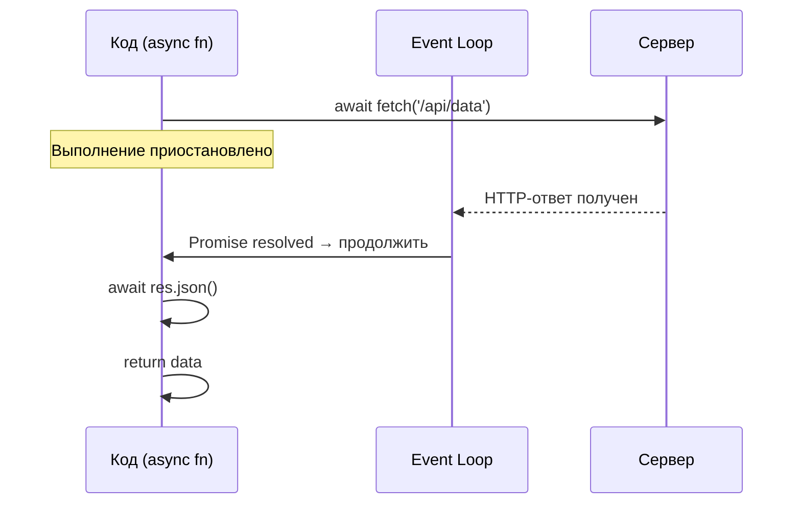

# Async/Await в JavaScript

`async/await` — синтаксический сахар над Promise, делающий асинхронный код читаемым как синхронный. Введён в ES2017.

## Основы

Функция с `async` всегда возвращает Promise. `await` приостанавливает выполнение функции до разрешения Promise — не блокируя при этом Event Loop.

```javascript
// Было: цепочка .then()
fetch('/api/user')
  .then(res => res.json())
  .then(data => console.log(data))
  .catch(err => console.error(err));

// Стало: async/await
async function getUser() {
  try {
    const res = await fetch('/api/user');
    const data = await res.json();
    console.log(data);
  } catch (err) {
    console.error(err);
  }
}
```

## Параллельное выполнение

`await` последовательно — если запросы независимы, используй `Promise.all`:

```javascript
// Медленно: 2 секунды (последовательно)
const user  = await fetchUser(1);   // 1с
const posts = await fetchPosts(1);  // 1с

// Быстро: ~1 секунда (параллельно)
const [user, posts] = await Promise.all([
  fetchUser(1),
  fetchPosts(1),
]);
```

## Обработка ошибок

```javascript
async function loadData() {
  try {
    const data = await fetchData();
    return data;
  } catch (error) {
    console.error('Ошибка:', error.message);
    throw error;        // пробросить дальше
  } finally {
    setLoading(false);  // выполнится всегда
  }
}
```

## Схема



## Карточки
- Чем `async/await` отличается от цепочки `.then()`?
- Как запустить несколько async-запросов параллельно?
- Что вернёт async-функция с `return 42`?
- Как обработать ошибку внутри async-функции?
