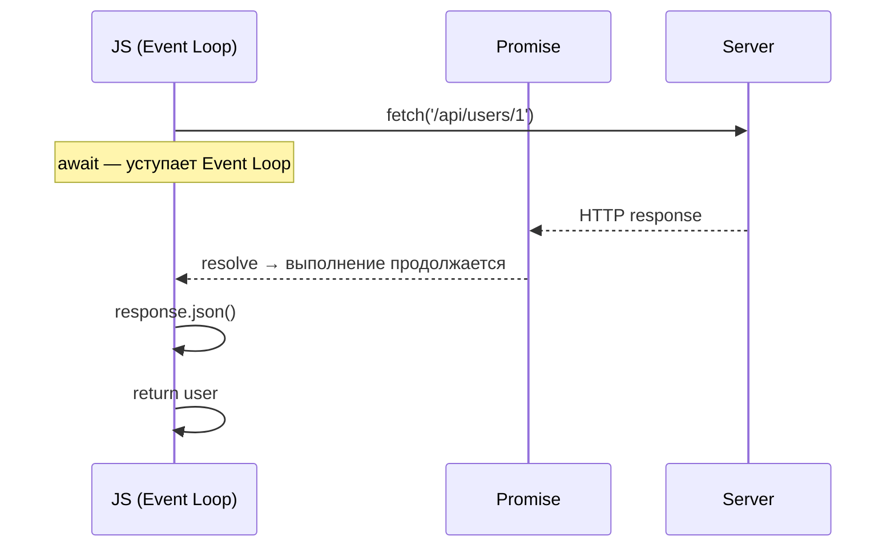

# Async/Await в JavaScript

`async/await` — синтаксический сахар над Promises, позволяющий писать асинхронный код в линейном, «синхронном» стиле без цепочек `.then()`.

## Основы

```js
async function fetchUser(id) {
  const response = await fetch(`/api/users/${id}`);
  const user = await response.json();
  return user; // возвращается как Promise.resolve(user)
}
```

`async` функция **всегда возвращает Promise**. `await` приостанавливает выполнение текущей функции до разрешения Promise, но не блокирует Event Loop — другой код продолжает работать.

## Обработка ошибок

```js
async function loadData() {
  try {
    const data = await fetchUser(1);
    console.log(data);
  } catch (err) {
    console.error('Ошибка:', err.message);
  } finally {
    console.log('Завершено');
  }
}
```

Без `try/catch` отклонённый Promise превратится в необработанную ошибку (`UnhandledPromiseRejection`).

## Параллельное выполнение

```js
// Последовательно — медленно (ждём каждый запрос)
const user  = await fetchUser(1);
const posts = await fetchPosts(1);

// Параллельно — быстро (оба запроса стартуют одновременно)
const [user, posts] = await Promise.all([
  fetchUser(1),
  fetchPosts(1),
]);
```

Используй `Promise.all` когда результаты независимы друг от друга.

## Схема



## Карточки

- Что делает ключевое слово `async` с функцией?
- Блокирует ли `await` Event Loop?
- Что произойдёт, если не обернуть `await` в `try/catch`?
- Чем `await Promise.all([...])` лучше нескольких последовательных `await`?
- Какой тип всегда возвращает `async` функция?
