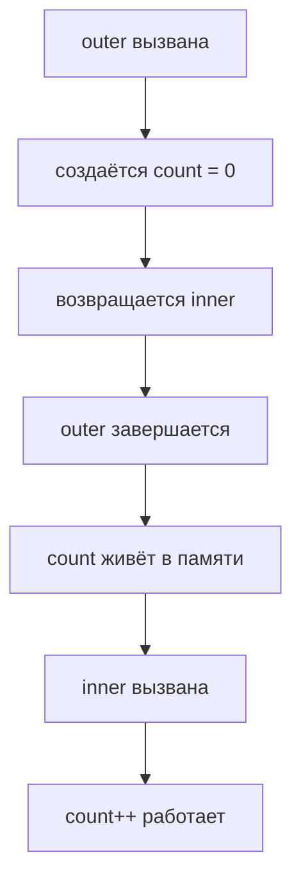

# Замыкания (Closures)

Замыкание — это функция, которая **запоминает переменные из внешней области видимости** даже после того, как внешняя функция завершила выполнение.

## Как это работает

Когда функция создаётся внутри другой функции, она получает доступ к переменным родителя. Этот доступ сохраняется даже после завершения родительской функции.

```js
function outer() {
  let count = 0;

  return function inner() {
    count++;
    return count;
  };
}

const increment = outer();
increment(); // 1
increment(); // 2
increment(); // 3
```

## Схема



## Практические применения

**Счётчики и приватные данные**

```js
function createCounter() {
  let n = 0;
  return {
    increment: () => ++n,
    decrement: () => --n,
    value: () => n,
  };
}

const c = createCounter();
c.increment(); // 1
c.increment(); // 2
c.value();     // 2
```

**Фабрики функций**

```js
function multiplier(factor) {
  return (num) => num * factor;
}

const double = multiplier(2);
const triple = multiplier(3);
double(5); // 10
triple(5); // 15
```

## Типичная ошибка с var

```js
// Все кнопки выведут 3
for (var i = 0; i < 3; i++) {
  btn[i].onclick = () => console.log(i);
}

// Правильно — let создаёт новую область для каждой итерации
for (let i = 0; i < 3; i++) {
  btn[i].onclick = () => console.log(i);
}
```

## Карточки

- Что такое замыкание в JavaScript?
- Как создать счётчик с приватным состоянием через замыкание?
- Почему var в цикле с setTimeout даёт неожиданный результат?
- Что такое фабрика функций?
