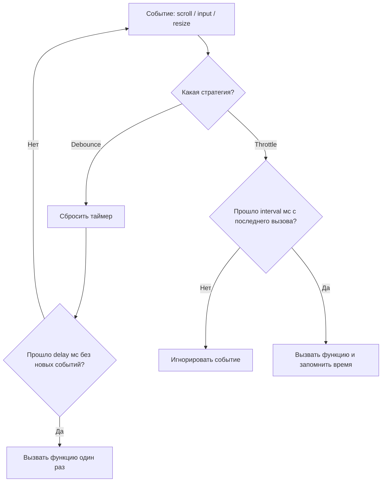

# Debounce и Throttle

Браузерные события вроде `scroll`, `resize`, `input` или `mousemove` могут срабатывать десятки раз в секунду. Если на каждое событие вешать тяжёлую обработку (запрос к серверу, пересчёт layout), интерфейс начинает тормозить. **Debounce** и **throttle** — два способа управлять частотой вызова функции-обработчика.

## Debounce

Идея: выполнить функцию только после того, как поток событий **прекратился** на заданное время. Каждое новое событие сбрасывает таймер ожидания.

```js
function debounce(fn, delay) {
  let timer;
  return (...args) => {
    clearTimeout(timer);
    timer = setTimeout(() => fn(...args), delay);
  };
}
```

Типичный пример — поле поиска: не нужно слать запрос на каждую букву, только когда пользователь остановился печатать.

## Throttle

Идея: выполнить функцию **не чаще**, чем раз в заданный интервал, независимо от того, как часто происходят события.

```js
function throttle(fn, interval) {
  let last = 0;
  return (...args) => {
    const now = Date.now();
    if (now - last >= interval) {
      last = now;
      fn(...args);
    }
  };
}
```

Типичный пример — обработчик скролла: нужно регулярно проверять позицию, но не на каждый пиксель прокрутки.

## Схема



## Сравнение на временной шкале

Если события идут каждые 50мс в течение 500мс:

```
События:     |--|--|--|--|--|--|--|--|--|--|
Debounce(200): вызов только один раз, через 200мс ПОСЛЕ последнего события
Throttle(150): вызовы примерно на 0мс, 150мс, 300мс, 450мс — регулярно, пока идут события
```

## Где применять

| Сценарий | Стратегия | Почему |
|---|---|---|
| Поиск по мере ввода | debounce | Важен только финальный запрос |
| Автосохранение формы | debounce | Не сохранять на каждое нажатие клавиши |
| Скролл-индикатор / infinite scroll | throttle | Нужно реагировать регулярно, а не один раз в конце |
| Resize окна (пересчёт layout) | throttle или debounce | Зависит от того, нужен ли промежуточный отклик |
| Клик по кнопке отправки формы | debounce | Защита от двойного сабмита |

## Библиотеки

В проде почти никогда не пишут debounce/throttle руками — используют проверенные реализации из `lodash` (`_.debounce`, `_.throttle`) или `lodash-es` для tree-shaking.

```js
import { debounce } from 'lodash-es';

const handleSearch = debounce((query) => fetchResults(query), 300);
```

## Карточки

- В чём разница между debounce и throttle?
- Для какого сценария лучше подходит debounce, а для какого — throttle?
- Что произойдёт, если события продолжают приходить чаще, чем `delay` в debounce?
- Как часто вызывается функция при throttle с интервалом 200мс, если события идут непрерывно?
