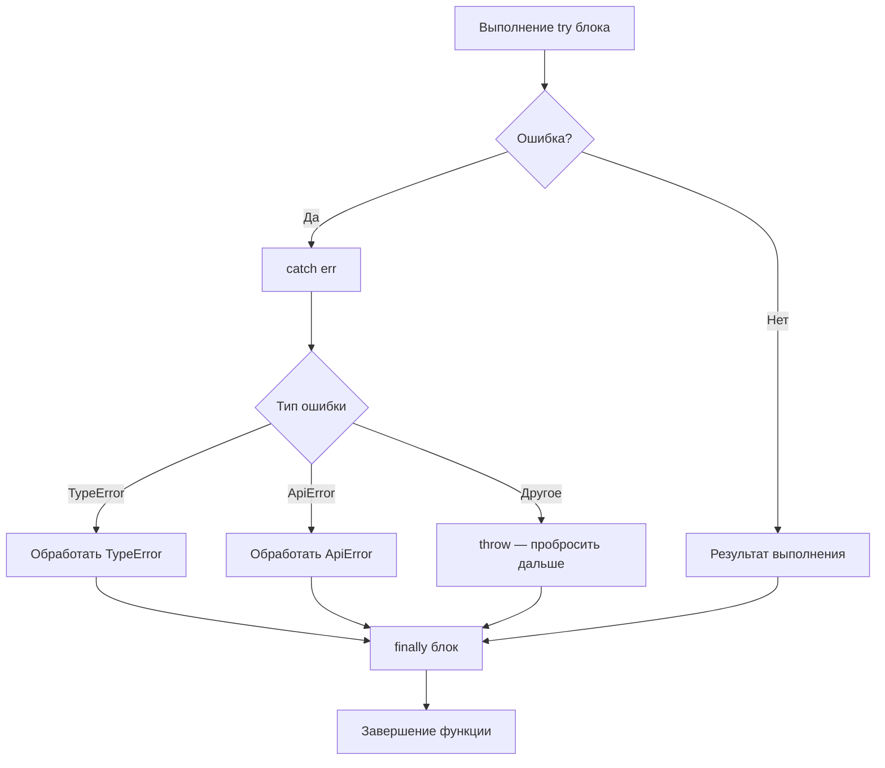

# Обработка ошибок в JavaScript

В JavaScript ошибки — это объекты класса `Error` и его подклассов. Их можно перехватить через `try/catch`, вручную выбросить через `throw`, и всегда выполнить cleanup-код через `finally`.

## Встроенные типы ошибок

| Тип | Когда возникает |
|-----|-----------------|
| `TypeError` | Вызов метода у `null`/`undefined`, неверный тип |
| `ReferenceError` | Использование необъявленной переменной |
| `SyntaxError` | Некорректный JSON (`JSON.parse`), недопустимый синтаксис |
| `RangeError` | Выход за допустимый диапазон (например, `new Array(-1)`) |

## Структура try/catch/finally

```js
try {
  const result = riskyOperation();
} catch (err) {
  if (err instanceof TypeError) {
    console.error('Type problem:', err.message);
  } else {
    throw err; // пробрасываем неизвестные ошибки дальше
  }
} finally {
  cleanup(); // выполняется всегда
}
```

## Кастомные ошибки

```js
class ApiError extends Error {
  constructor(message, status) {
    super(message);
    this.name = 'ApiError';
    this.status = status;
  }
}

throw new ApiError('Not found', 404);
```

## Ошибки в async/await

```js
async function fetchData(url) {
  try {
    const res = await fetch(url);
    if (!res.ok) throw new ApiError(res.statusText, res.status);
    return await res.json();
  } catch (err) {
    console.error('Fetch failed:', err);
    throw err;
  }
}
```

## Схема



## Карточки
- Как работает try/catch/finally в JavaScript?
- Что такое optional chaining (?.) и nullish coalescing (??) в JS?
