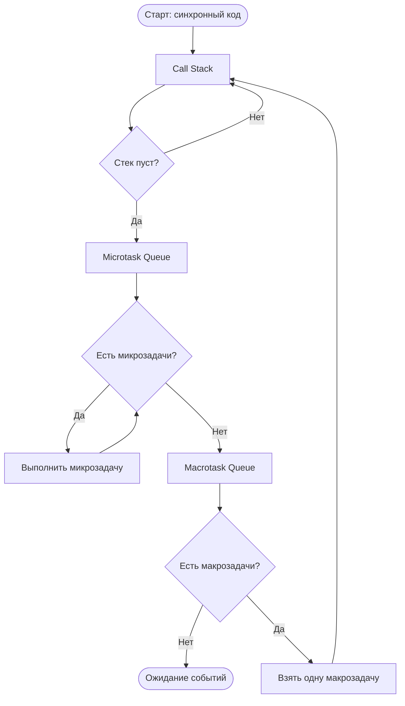

# JavaScript Event Loop

Event Loop (цикл событий) — механизм, который позволяет JavaScript выполнять асинхронные операции, несмотря на то что язык однопоточный.

## Как это работает

JavaScript выполняется в одном потоке. Весь код попадает в **Call Stack** (стек вызовов). Когда стек пуст, Event Loop берёт задачи из очередей.

Существуют две очереди:

- **Microtask Queue** (микрозадачи): `Promise.then`, `queueMicrotask`, `MutationObserver`
- **Macrotask Queue** (макрозадачи): `setTimeout`, `setInterval`, события DOM, I/O

**Порядок выполнения за один «тик»:**
1. Весь синхронный код (Call Stack опустошается)
2. Все накопившиеся микрозадачи — до последней
3. Одна макрозадача
4. Снова все микрозадачи → снова одна макрозадача → ...

```js
console.log('1 — синхронный');

setTimeout(() => console.log('3 — макрозадача'), 0);

Promise.resolve().then(() => console.log('2 — микрозадача'));

// Вывод: 1 → 2 → 3
```

## Схема



## Карточки

- Чем async/await отличается от .then()/.catch()?
- Что такое Event Loop в JavaScript?
- В каком порядке выполняются Promise.then() и setTimeout()?
