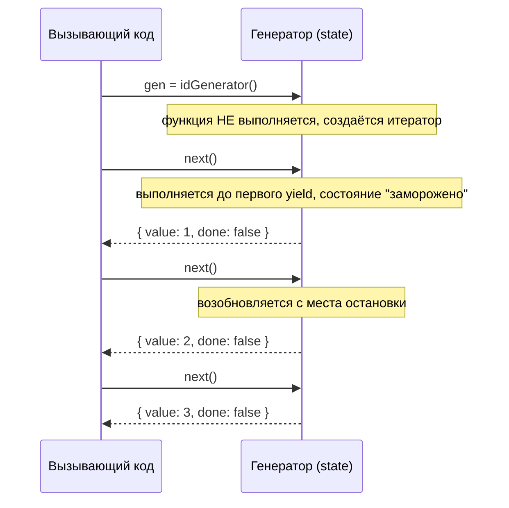

# Генераторы и итераторы в JavaScript

**Итератор (iterator)** — это объект с методом `next()`, который возвращает `{ value, done }`. Любой объект, реализующий протокол итератора (или `Symbol.iterator`), можно перебирать через `for...of`.

**Генератор (generator)** — функция, объявленная как `function*`, которая при вызове не выполняется сразу, а возвращает объект-итератор. Каждый вызов `.next()` продолжает выполнение до следующего `yield`, «замораживая» состояние функции между вызовами.

```js
function* idGenerator() {
  let id = 1;
  while (true) {
    yield id++;
  }
}

const gen = idGenerator();
gen.next().value; // 1
gen.next().value; // 2
gen.next().value; // 3
```

Обратите внимание: генератор выше — **бесконечный**, но это не зависает, потому что код выполняется только по требованию (лениво), по одному шагу за вызов `next()`.

## yield как двусторонний канал

`yield` не только отдаёт значение наружу, но и может **принять** значение обратно через аргумент `next(value)`:

```js
function* echo() {
  const first = yield 'ready?';
  const second = yield `got: ${first}`;
  return `done with ${second}`;
}

const it = echo();
it.next();        // { value: 'ready?', done: false }
it.next('hi');     // { value: 'got: hi', done: false }
it.next('bye');    // { value: 'done with bye', done: true }
```

## delegating: yield*

Генератор может делегировать часть работы другому итерируемому объекту:

```js
function* inner() {
  yield 1;
  yield 2;
}

function* outer() {
  yield 0;
  yield* inner(); // передаёт управление inner()
  yield 3;
}

[...outer()]; // [0, 1, 2, 3]
```

## Практическое применение

- **Ленивые последовательности** — бесконечные диапазоны, потоки данных, которые невозможно материализовать в массив целиком
- **Кастомные итераторы** — реализация `[Symbol.iterator]` для собственных структур данных, чтобы они работали с `for...of` и spread `[...obj]`
- **Основа async/await** — исторически `async function` реализовывалась поверх генераторов + промисов: `await` приостанавливает выполнение так же, как `yield`, только автоматически возобновляется, когда промис резолвится

## Схема



## Генераторы vs обычные функции

| | Обычная функция | Генератор |
|---|---|---|
| Выполнение | сразу целиком | по шагам, через `.next()` |
| Возврат | одно значение | поток значений (`yield` много раз) |
| Состояние | не сохраняется между вызовами | сохраняется между `.next()` |
| Может быть бесконечным | нет (завершится или зависнет) | да, безопасно (ленивое вычисление) |

## Карточки

- Что такое генераторы (generators) в JavaScript?
- Чем итератор отличается от генератора?
- Как `yield` может принимать значение обратно через `next(value)`?
- Для чего используется `yield*` и что такое делегирование в генераторах?
- Как генераторы связаны с async/await под капотом?
