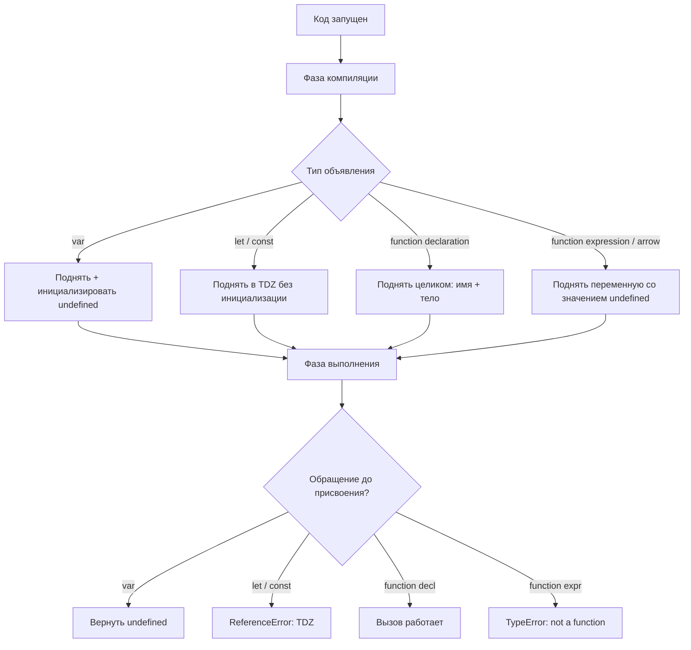

# JavaScript Hoisting

Hoisting — это поведение JavaScript-движка, при котором **объявления** переменных и функций перемещаются в начало своей области видимости на этапе компиляции (до выполнения кода). Важно понимать: поднимается только **объявление**, но не **присвоение**.

## Как это работает

### var
`var` объявляется и инициализируется значением `undefined` при подъёме.

```js
console.log(x); // undefined — не ошибка!
var x = 10;
console.log(x); // 10
```

### let и const
`let` и `const` тоже поднимаются, но попадают в **Temporal Dead Zone (TDZ)** — зону, в которой обращение к переменной вызывает `ReferenceError`.

```js
console.log(y); // ReferenceError: Cannot access 'y' before initialization
let y = 5;
```

### Функции-объявления
Поднимаются полностью — с именем и телом. Можно вызвать до объявления.

```js
sayHi(); // "Hi!" — работает
function sayHi() { console.log("Hi!"); }
```

### Функции-выражения и стрелочные функции
При присвоении в `var` — поднимается только переменная (значение `undefined`), вызов до объявления даёт `TypeError`.

```js
sayBye(); // TypeError: sayBye is not a function
var sayBye = function() { console.log("Bye!"); };
```

## Схема



## Советы

- Всегда объявляй переменные **в начале** области видимости, чтобы избежать путаницы.
- Предпочитай `const` и `let` вместо `var` — их поведение более предсказуемо.
- Помни: `let`/`const` в TDZ — это не «не поднято», а «поднято, но недоступно».

## Карточки
- Что такое hoisting в JavaScript?
- Чем отличается поведение `var` от `let`/`const` при hoisting?
- Что такое Temporal Dead Zone (TDZ)?
- Можно ли вызвать function declaration до её объявления в коде?
