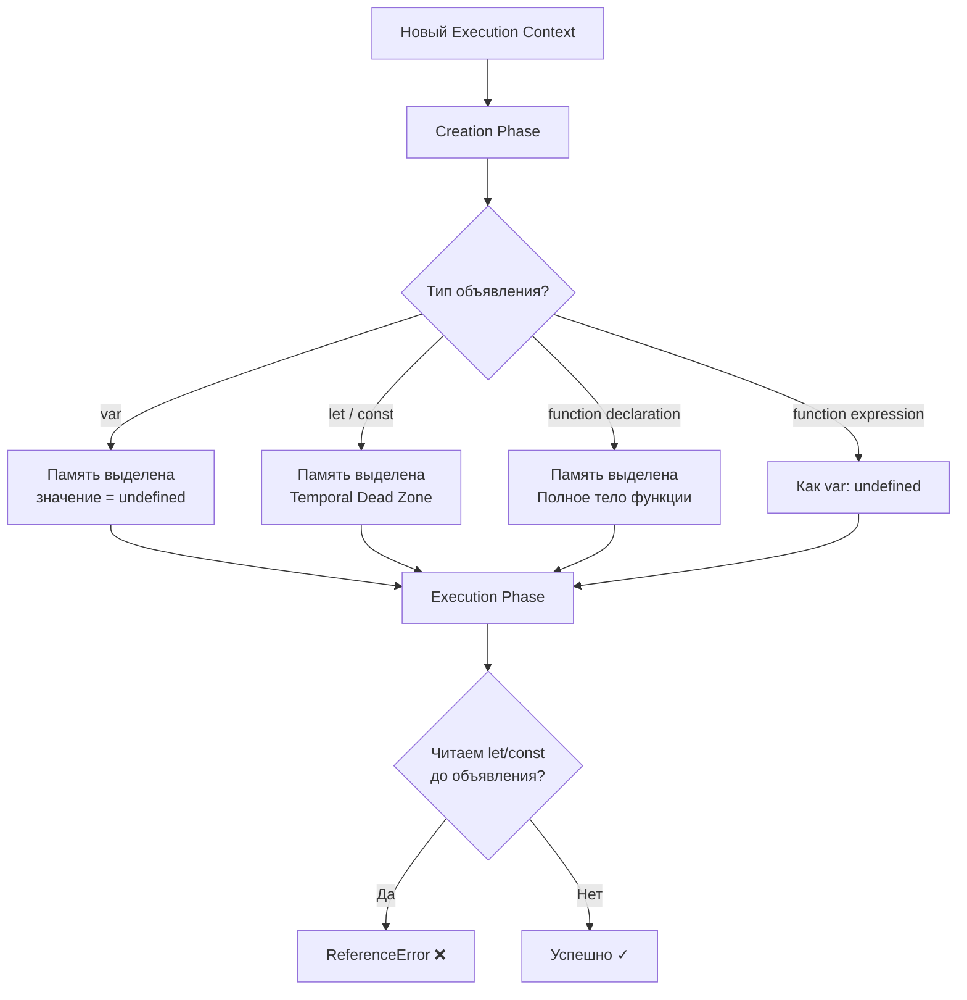

# JavaScript Hoisting

Hoisting (поднятие) — поведение JavaScript-интерпретатора, при котором объявления переменных и функций обрабатываются до выполнения кода. Это происходит на этапе создания контекста выполнения (Execution Context Creation Phase).

## Как это работает

Когда движок V8 встречает новый execution context, он проходит по коду в два этапа:

1. **Creation Phase** — сканирует объявления и выделяет память
2. **Execution Phase** — выполняет код построчно

Результат Creation Phase зависит от типа объявления:

| Объявление | Память | Начальное значение |
|---|---|---|
| `var` | выделяется | `undefined` |
| `let` / `const` | выделяется | Temporal Dead Zone |
| `function` declaration | выделяется | Полное тело функции |
| `function` expression | как `var` | `undefined` |

## Temporal Dead Zone (TDZ)

TDZ — промежуток от начала блока до строки объявления `let`/`const`. Любое обращение к переменной в этот период бросает `ReferenceError`.

```js
// TDZ для x начинается здесь
console.log(x); // ReferenceError: Cannot access 'x' before initialization
let x = 5;     // TDZ заканчивается здесь
```

## Примеры

```js
// var: поднимается с undefined
console.log(a); // undefined
var a = 10;
console.log(a); // 10

// function declaration: поднимается целиком
sayHi(); // "Hi!"
function sayHi() {
  console.log("Hi!");
}

// function expression: ведёт себя как var
greet(); // TypeError: greet is not a function
var greet = function() {
  console.log("Hello");
};

// let/const: TDZ
console.log(b); // ReferenceError
let b = 20;
```

## Схема



## Частые ошибки

```js
// Ошибка 1: ожидаем значение, получаем undefined
console.log(count); // undefined (не 5!)
var count = 5;

// Ошибка 2: вызов function expression как function declaration
const result = double(4); // ReferenceError (const в TDZ)
const double = (n) => n * 2;

// Правильно: function declaration можно вызвать до объявления
const result2 = triple(4); // 12 — OK
function triple(n) { return n * 3; }
```

## Карточки
- Что такое hoisting в JavaScript?
- Что такое Temporal Dead Zone (TDZ)?
- Чем отличается поднятие var от let/const?
- Поднимаются ли function expressions так же, как function declarations?
