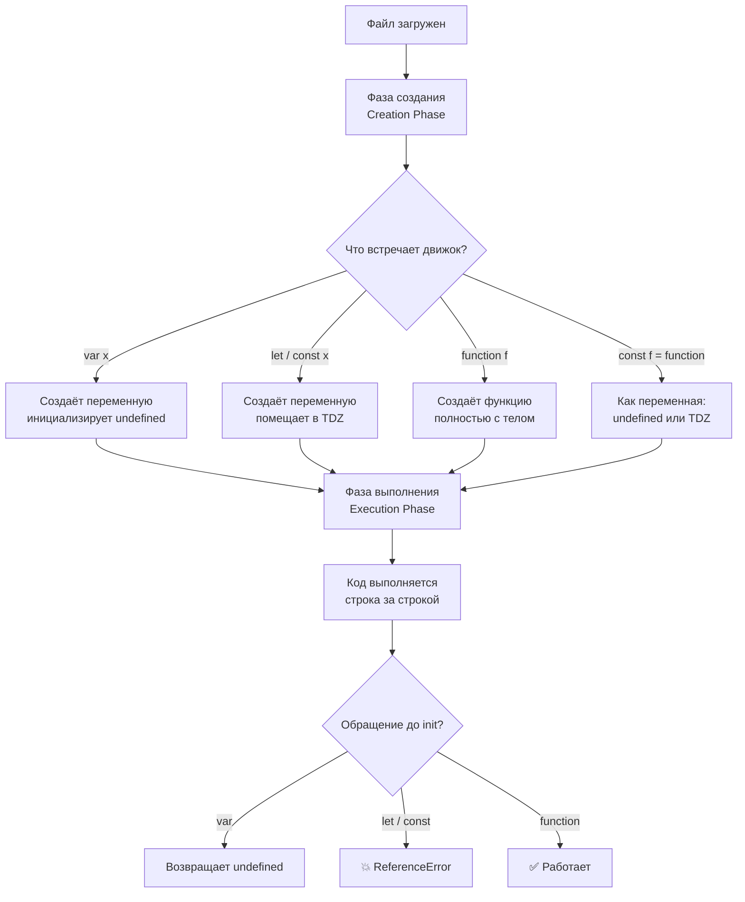

# JavaScript Hoisting

Hoisting (подъём) — механизм JS, при котором объявления переменных и функций обрабатываются движком до начала построчного выполнения кода. Важно понимать: поднимается только *объявление*, но не *инициализация*.

## var — объявление поднимается, значение нет

```js
console.log(score); // undefined — не ошибка!
var score = 100;

// Движок видит это так:
var score;           // поднимается в начало
console.log(score);  // undefined
score = 100;         // инициализация остаётся на месте
```

## let и const — Temporal Dead Zone (TDZ)

`let` и `const` тоже поднимаются, но переменная остаётся в «мёртвой зоне» с начала блока до строки объявления. Любое обращение в этот период — `ReferenceError`.

```js
console.log(age); // ReferenceError: Cannot access 'age' before initialization
let age = 25;
```

## function declaration — поднимается полностью

```js
greet(); // "Привет!" — работает до объявления
function greet() {
  console.log('Привет!');
}
```

## function expression — только переменная

```js
sayBye(); // TypeError: sayBye is not a function
var sayBye = function () {
  console.log('Пока!');
};
```

## Схема



## Практические правила

1. Всегда объявляй переменные в начале блока — код будет предсказуемым
2. Используй `const` по умолчанию, `let` — когда нужно переприсваивание, `var` — избегай
3. Не рассчитывай на hoisting как на фичу — это источник трудноуловимых багов

## Карточки
- Что такое hoisting в JavaScript?
- В чём разница между hoisting для var и let/const?
- Можно ли вызвать function declaration до её объявления?
- Что такое Temporal Dead Zone (TDZ)?
