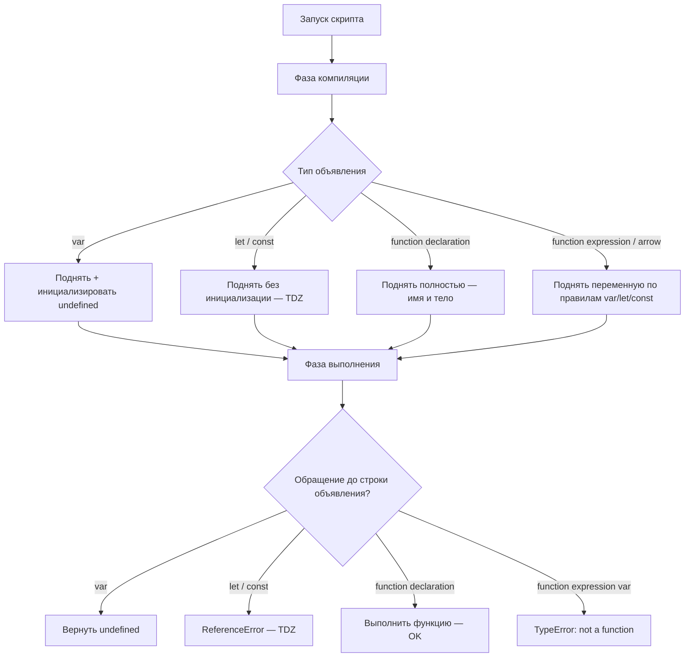

# Hoisting в JavaScript

Hoisting (поднятие) — поведение JavaScript, при котором объявления переменных и функций обрабатываются **до** выполнения кода. Во время фазы компиляции движок сканирует код и «поднимает» объявления наверх своей области видимости.

## Правила для разных типов объявлений

**`var`** — объявление поднимается и инициализируется значением `undefined`. Присвоение остаётся на месте.

**`let` и `const`** — объявление поднимается, но **не** инициализируется. Период между началом scope и строкой объявления называется **Temporal Dead Zone (TDZ)**. Обращение в TDZ — `ReferenceError`.

**Function declaration** — поднимается полностью: и имя, и тело. Можно вызывать до строки определения.

**Function expression / Arrow function** — поднимается только переменная (по правилам `var`/`let`/`const`), но не функция.

```js
// var
console.log(x); // undefined
var x = 10;
console.log(x); // 10

// let — TDZ
console.log(y); // ReferenceError
let y = 20;

// Function declaration — полный hoisting
greet(); // "Hello!"
function greet() {
  console.log("Hello!");
}

// Function expression
sayHi(); // TypeError: sayHi is not a function
var sayHi = function() { console.log("Hi!"); };
```

## Temporal Dead Zone (TDZ)

TDZ — «мёртвая зона» для `let`/`const`. Переменная уже существует в памяти (движок её знает), но недоступна.

```js
{
  // TDZ для 'a' начинается здесь
  console.log(typeof a); // ReferenceError (не "undefined"!)
  let a = 5;             // TDZ заканчивается здесь
  console.log(a);        // 5
}
```

## Схема



## Лучшие практики

- Всегда используй `const` и `let`, избегай `var`
- Объявляй переменные в начале блока/функции
- Function expression объявляй до первого вызова
- Используй линтеры (ESLint `no-use-before-define`) для автоматического контроля

## Карточки

- Что такое hoisting (поднятие) в JavaScript?
- Что такое Temporal Dead Zone (TDZ)?
