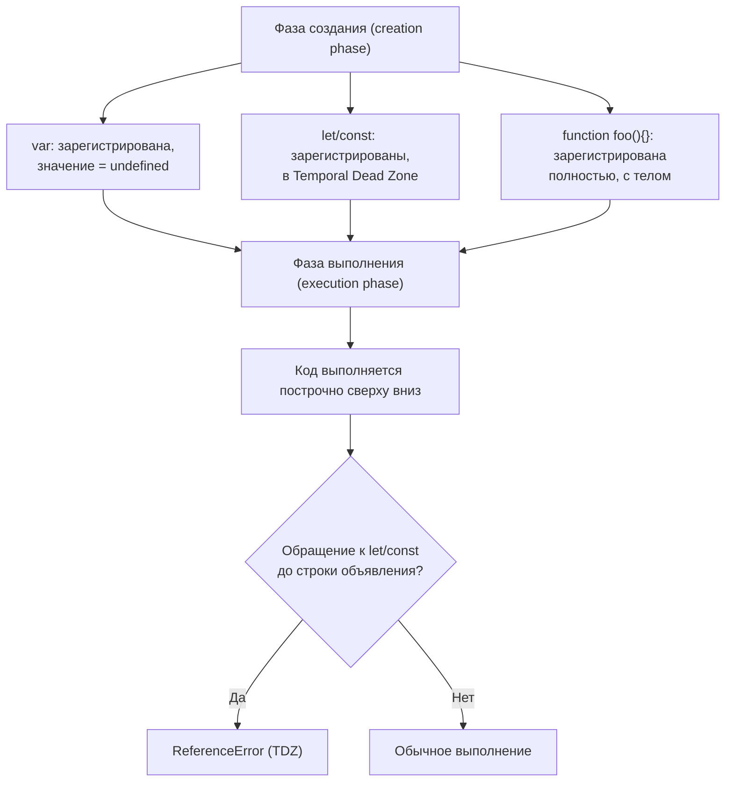

# Hoisting (всплытие) в JavaScript

**Hoisting** — поведение JavaScript, при котором объявления переменных и функций как бы «поднимаются» в начало своей области видимости ещё до выполнения кода. На самом деле код никуда физически не перемещается — двигатель JS обрабатывает объявления на отдельном, предварительном проходе.

## Две фазы выполнения

Перед тем как выполнить код построчно, движок JS проходит **фазу создания (creation phase)**:

1. Регистрирует все объявления `var`, `function`, `let`, `const` в текущей области видимости
2. `var` и объявления функций сразу получают память и (для `var`) значение `undefined`
3. `let`/`const` тоже регистрируются, но остаются в «мёртвой зоне» — недоступны до реальной строки объявления

Затем начинается **фаза выполнения (execution phase)** — код выполняется построчно сверху вниз.

## `var` — всплывает со значением `undefined`

```js
console.log(x); // undefined, а не ReferenceError
var x = 5;
console.log(x); // 5

// Эквивалентно тому, как будто движок сделал:
// var x;
// console.log(x); // undefined
// x = 5;
// console.log(x); // 5
```

## `let` / `const` — Temporal Dead Zone (TDZ)

`let` и `const` тоже «всплывают», но обращение к ним до строки объявления бросает ошибку — этот промежуток называется **временной мёртвой зоной**.

```js
console.log(y); // ReferenceError: Cannot access 'y' before initialization
let y = 10;
```

Переменная физически «существует» в области видимости (поэтому не «not defined»), но JS запрещает её использовать, пока не выполнена строка объявления — это осознанное ограничение, защищающее от использования переменной до её реальной инициализации.

## Функции всплывают полностью — с телом

Объявления функций (`function foo() {}`) всплывают целиком, включая тело — их можно вызывать до объявления в коде:

```js
sayHi(); // "Привет!" — работает

function sayHi() {
  console.log("Привет!");
}
```

**Функциональные выражения** (в том числе стрелочные) ведут себя как переменные — всплывает только объявление, а не значение:

```js
sayBye(); // TypeError: sayBye is not a function
var sayBye = function () {
  console.log("Пока!");
};
```

## Сравнение

| | Всплывает объявление | Доступно до строки объявления | Значение до инициализации |
|---|---|---|---|
| `var` | Да | Да | `undefined` |
| `let` / `const` | Да | Нет (TDZ) | ReferenceError |
| `function foo() {}` | Да, с телом | Да | сама функция |
| `const foo = () => {}` | Да (как `const`) | Нет (TDZ) | ReferenceError |

## Схема



## Частые ошибки junior-разработчиков

- Ожидать `ReferenceError` для `var` до объявления — на деле это `undefined`, что маскирует баги
- Не понимать, почему `let`/`const` "не всплывают", хотя технически они тоже регистрируются в фазе создания — просто недоступны из-за TDZ
- Полагаться на порядок объявления функциональных выражений (`const fn = () => {}`) так же, как на `function fn() {}` — это разное поведение

## Карточки

- Что такое hoisting и что на самом деле происходит "под капотом"?
- Почему `console.log(x); var x = 5;` не бросает ошибку, а `console.log(y); let y = 5;` бросает?
- Что такое Temporal Dead Zone?
- Чем всплытие `function foo() {}` отличается от всплытия `const foo = () => {}`?
