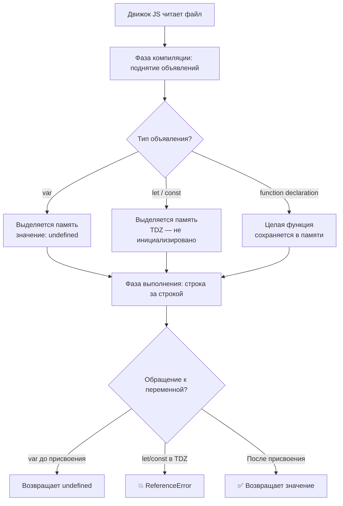

# JavaScript Hoisting

**Hoisting** (поднятие) — механизм JavaScript, при котором **объявления** переменных и функций перемещаются движком в начало своей области видимости до выполнения кода. Важно: поднимается только объявление, но не инициализация.

## var, let, const и функции

| Ключевое слово | Поднимается? | Значение до инициализации | TDZ |
|----------------|-------------|--------------------------|-----|
| `var` | Да | `undefined` | Нет |
| `let` | Да | — | Да |
| `const` | Да | — | Да |
| `function` (декларация) | Да, полностью | Готова к вызову | Нет |
| `const f = () => {}` | Только переменная | `undefined` | Нет |

## Temporal Dead Zone (TDZ)

TDZ — промежуток от начала области видимости до строки объявления переменной `let`/`const`. Обращение к ней в этом промежутке вызывает `ReferenceError`.

```js
// var — доступен до объявления
console.log(x); // undefined
var x = 10;

// let — Temporal Dead Zone, ошибка!
console.log(y); // ReferenceError: Cannot access 'y' before initialization
let y = 10;

// function declaration — поднимается целиком
sayHi(); // "Hi!"
function sayHi() {
  console.log("Hi!");
}

// function expression — поднимается только var-переменная
sayBye(); // TypeError: sayBye is not a function
var sayBye = function () {
  console.log("Bye!");
};
```

## Практическое правило

Всегда объявляйте переменные **в начале области видимости** и используйте `const`/`let` вместо `var`, чтобы избежать скрытых ошибок из-за hoisting.

## Схема



## Карточки

- Что такое hoisting в JavaScript?
- Что такое Temporal Dead Zone (TDZ)?
- Чем отличается поднятие `var` от `let`/`const`?
