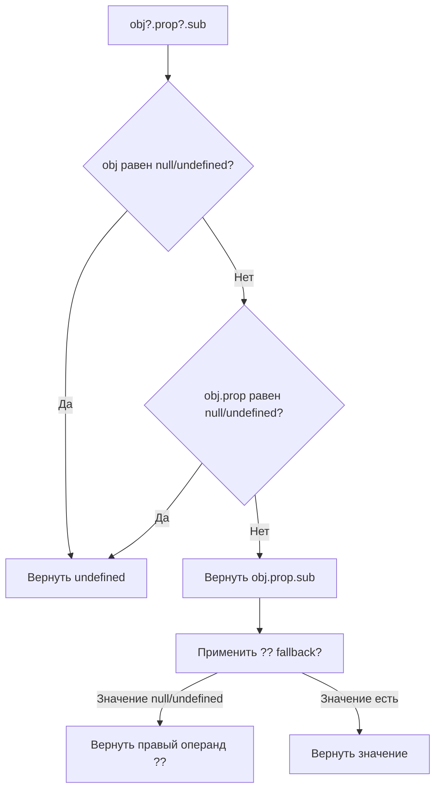

# Optional Chaining и Nullish Coalescing в JavaScript

Два оператора из ES2020, которые решают одну из самых частых проблем в JavaScript: безопасный доступ к вложенным свойствам объектов и корректный fallback для «пустых» значений.

## Проблема: обращение к свойствам null/undefined

До ES2020 для защиты от ошибки `TypeError: Cannot read properties of null` нужно было писать длинные проверки:

```js
// Старый способ — многословно и легко ошибиться
const city = user && user.address && user.address.city;

// С тернарным оператором — ещё хуже
const port = config ? (config.server ? config.server.port : undefined) : undefined;
```

## Оператор Optional Chaining `?.`

`?.` прерывает цепочку обращений, если значение слева равно `null` или `undefined`, и **возвращает `undefined`** — без выброса ошибки.

```js
const user = {
  name: 'Alice',
  address: { city: 'Moscow' }
};

// Безопасный доступ к свойствам
console.log(user?.address?.city);   // 'Moscow'
console.log(user?.phone?.number);   // undefined (не ошибка)

// Безопасный вызов метода
const len = user.getName?.();       // undefined, если метода нет

// Безопасное обращение к элементу массива
const first = arr?.[0];             // undefined, если arr равен null/undefined

// Динамический ключ
const key = 'city';
console.log(user?.address?.[key]);  // 'Moscow'
```

## Оператор Nullish Coalescing `??`

`??` возвращает **правый** операнд только если левый равен `null` или `undefined`. Это главное отличие от `||`, который срабатывает на любое falsy-значение.

```js
// || срабатывает на ВСЕ falsy-значения
console.log(0     || 'default'); // 'default' ← 0 потерян!
console.log(''    || 'default'); // 'default' ← пустая строка потеряна!
console.log(false || 'default'); // 'default' ← false потерян!

// ?? срабатывает ТОЛЬКО на null/undefined
console.log(0     ?? 'default'); // 0       ← сохранён
console.log(''    ?? 'default'); // ''      ← сохранена
console.log(false ?? 'default'); // false   ← сохранён
console.log(null  ?? 'default'); // 'default'
console.log(undefined ?? 'default'); // 'default'
```

## Комбинирование `?.` и `??`

Очень часто операторы используются вместе — сначала безопасно достаём значение, потом задаём дефолт:

```js
const config = null;

// Получить порт или дефолтный 3000
const port = config?.server?.port ?? 3000;
console.log(port); // 3000

// Имя пользователя или 'Гость'
const displayName = user?.profile?.displayName ?? 'Гость';

// Длина массива или 0
const count = data?.items?.length ?? 0;
```

## Схема



## Частые ошибки

```js
// ❌ Нельзя смешивать ?? с || и && без скобок — SyntaxError
const val = a || b ?? c;

// ✅ Нужны скобки
const val = (a || b) ?? c;

// ❌ ?. не защитит, если obj существует, но промежуточное свойство — нет
const obj = {};
obj.foo.bar;   // TypeError: Cannot read properties of undefined
obj.foo?.bar;  // undefined ← защитит только если foo равен null/undefined

// Здесь foo существует, но равен undefined (не null) — ?. сработает
const obj2 = { foo: undefined };
console.log(obj2.foo?.bar); // undefined ✅

// ❌ Нельзя использовать ?. при присваивании
obj?.foo = 'bar'; // SyntaxError
```

## Поддержка браузерами

`?.` и `??` поддерживаются во всех современных браузерах и Node.js 14+. Для старых окружений используй Babel или TypeScript с соответствующим `target`.

## Карточки
- Что вернёт `null?.foo`?
- Чем `??` отличается от `||`?
- Как безопасно вызвать метод объекта, которого может не быть?
- Можно ли смешивать `??` с `||` без скобок?
- Что вернёт `0 ?? 'default'`?
