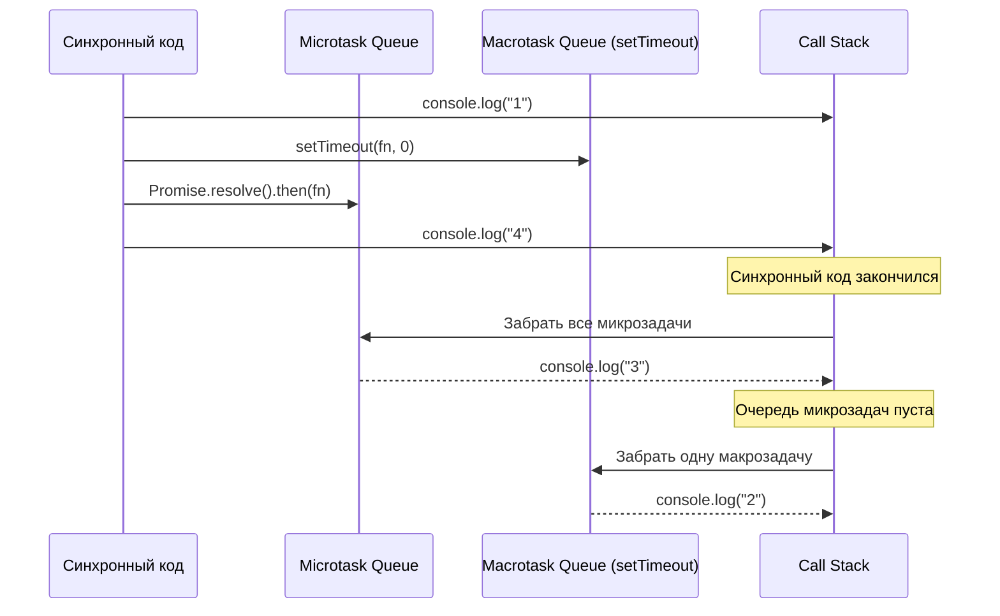

# Promises и Async/Await

Promise — объект, представляющий результат **асинхронной операции**, которая ещё не завершилась, но завершится в будущем (успешно или с ошибкой). Это способ избежать «callback hell» — вложенных друг в друга колбэков.

## Три состояния промиса

Promise может находиться только в одном из трёх состояний, и переход **необратим**:

- **pending** — начальное состояние, результат ещё не готов
- **fulfilled** — операция завершилась успешно, есть значение
- **rejected** — операция завершилась с ошибкой

```js
const promise = new Promise((resolve, reject) => {
  fetchData()
    ? resolve(data)   // pending -> fulfilled
    : reject(error);  // pending -> rejected
});
```

После перехода в fulfilled или rejected промис уже никогда не сменит состояние — он "расчехлён" (settled).

## then / catch / finally

```js
fetch("/api/users")
  .then(response => response.json())
  .then(users => console.log(users))
  .catch(error => console.error("Ошибка:", error))
  .finally(() => console.log("Запрос завершён"));
```

`.then()` возвращает **новый** промис, поэтому цепочки можно строить сколько угодно длинными. Ошибка в любом звене пролетает вниз до ближайшего `.catch()`.

## Async/Await — синтаксический сахар

`async function` всегда возвращает промис. `await` приостанавливает выполнение функции до разрешения промиса, не блокируя основной поток (микрозадача продолжится после текущего синхронного кода).

```js
async function loadUser(id) {
  try {
    const response = await fetch(`/api/users/${id}`);
    if (!response.ok) throw new Error(`HTTP ${response.status}`);
    const user = await response.json();
    return user;
  } catch (error) {
    console.error("Не удалось загрузить пользователя:", error);
    throw error;
  }
}
```

## Параллельное выполнение

Частая ошибка джуниора — ждать промисы **последовательно**, когда они не зависят друг от друга:

```js
// Плохо: 3 запроса выполняются по очереди (медленно)
const user = await fetchUser();
const posts = await fetchPosts();
const comments = await fetchComments();

// Хорошо: запросы летят параллельно
const [user, posts, comments] = await Promise.all([
  fetchUser(),
  fetchPosts(),
  fetchComments(),
]);
```

## Методы группировки промисов

| Метод | Поведение |
|---|---|
| `Promise.all` | Ждёт все; падает целиком при первой же ошибке |
| `Promise.allSettled` | Ждёт все; никогда не падает, возвращает статус каждого |
| `Promise.race` | Возвращает результат **первого** завершившегося (успех или ошибка) |
| `Promise.any` | Возвращает первый **успешный**; падает, только если упали все |

## Микрозадачи и очередь

Промисы выполняются через **очередь микрозадач** (microtask queue), которая имеет приоритет выше, чем очередь макрозадач (`setTimeout`, события):

```js
console.log("1");
setTimeout(() => console.log("2"), 0);
Promise.resolve().then(() => console.log("3"));
console.log("4");
// Порядок вывода: 1, 4, 3, 2
```

## Схема



## Карточки

- Какие три состояния может принимать Promise и обратимы ли переходы между ними?
- Чем `Promise.all` отличается от `Promise.allSettled`?
- Почему `await` в цикле для независимых запросов — плохая практика?
- В каком порядке выполнятся `console.log`, `setTimeout` и `Promise.then`?
- Что произойдёт с ошибкой, выброшенной внутри `async`-функции без `try/catch`?
