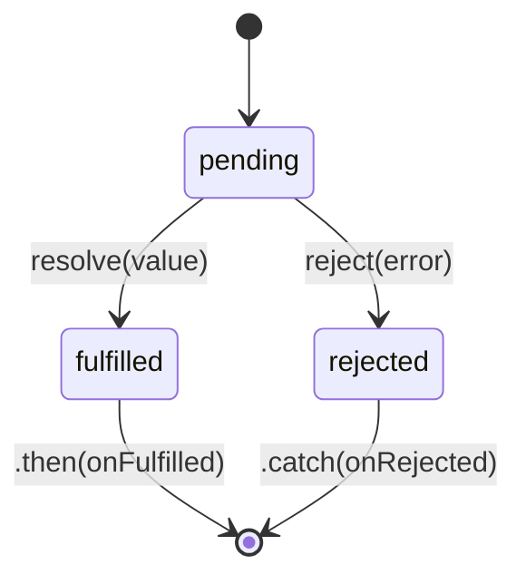

# Promises в JavaScript

**Promise** — объект, представляющий результат асинхронной операции, которого ещё нет, но который появится в будущем (или операция завершится ошибкой). Он избавляет от «callback hell» — глубокой вложенности колбэков.

## Три состояния

Promise может находиться только в одном из трёх состояний, и переход необратим:

- **pending** — исходное состояние, результата ещё нет
- **fulfilled** — операция завершилась успешно, есть значение
- **rejected** — операция завершилась с ошибкой

```js
const promise = new Promise((resolve, reject) => {
  fetchData()
    .then(data => resolve(data))
    .catch(err => reject(err));
});
```

Как только promise перешёл в `fulfilled` или `rejected`, он считается **settled** — состояние больше никогда не изменится, даже если вызвать `resolve`/`reject` повторно.

## Цепочки `.then()`

Каждый `.then()` возвращает **новый** promise, поэтому вызовы можно выстраивать в цепочку — значение из предыдущего шага передаётся в следующий:

```js
fetchUser(id)
  .then(user => fetchOrders(user.id))
  .then(orders => orders.filter(o => o.status === 'active'))
  .then(activeOrders => console.log(activeOrders))
  .catch(err => console.error('Ошибка на любом из шагов:', err));
```

Один `.catch()` в конце ловит ошибку из **любого** шага цепочки — не нужно оборачивать каждый `.then()` отдельно.

## async/await — синтаксический сахар над Promise

```js
async function loadActiveOrders(id) {
  try {
    const user = await fetchUser(id);
    const orders = await fetchOrders(user.id);
    return orders.filter(o => o.status === 'active');
  } catch (err) {
    console.error('Ошибка:', err);
    throw err;
  }
}
```

`await` можно использовать только внутри функции, помеченной `async`. Под капотом это та же цепочка `.then()`, просто выглядит как синхронный код.

## Promise.all / allSettled / race / any

| Метод | Поведение | Когда использовать |
|---|---|---|
| `Promise.all` | Ждёт все; падает при первой ошибке | Все запросы обязательны |
| `Promise.allSettled` | Ждёт все; ошибки не прерывают | Нужны результаты всех, даже если часть упала |
| `Promise.race` | Возвращает первый settled (успех или ошибка) | Таймауты, «кто быстрее» |
| `Promise.any` | Возвращает первый успешный, игнорируя ошибки | Достаточно одного успеха из нескольких источников |

```js
// Все запросы обязательны — если один упадёт, весь Promise.all упадёт
const [user, orders, settings] = await Promise.all([
  fetchUser(id),
  fetchOrders(id),
  fetchSettings(id),
]);

// Нужны результаты всех, но не критично, если часть упадёт
const results = await Promise.allSettled([fetchUser(id), fetchOrders(id)]);
results.forEach(r => {
  if (r.status === 'fulfilled') console.log(r.value);
  else console.error(r.reason);
});
```

## Частые ошибки junior-разработчиков

- **Забыть `return` внутри `.then()`** — следующий `.then()` получит `undefined` вместо реального значения.
- **Не обработать rejection** — необработанный отклонённый promise падает в консоль как `Unhandled promise rejection` и может уронить процесс в Node.js.
- **`await` в цикле вместо `Promise.all`** — последовательные запросы там, где они независимы, резко замедляют выполнение:
  ```js
  // ❌ Медленно: запросы идут один за другим
  for (const id of ids) {
    await fetchUser(id);
  }

  // ✅ Быстро: запросы идут параллельно
  await Promise.all(ids.map(id => fetchUser(id)));
  ```
- **Смешивание `.then()` и `await`** в одной функции — код становится трудно читать; лучше выбрать один стиль.

## Схема



## Карточки

- Какие три состояния может принимать Promise и может ли он вернуться в предыдущее?
- Чем `Promise.all` отличается от `Promise.allSettled`?
- Что произойдёт, если забыть `return` внутри `.then()`?
- Почему `await` внутри цикла `for` может сильно замедлить код и как это исправить?
- Как связаны `async/await` и Promise под капотом?
