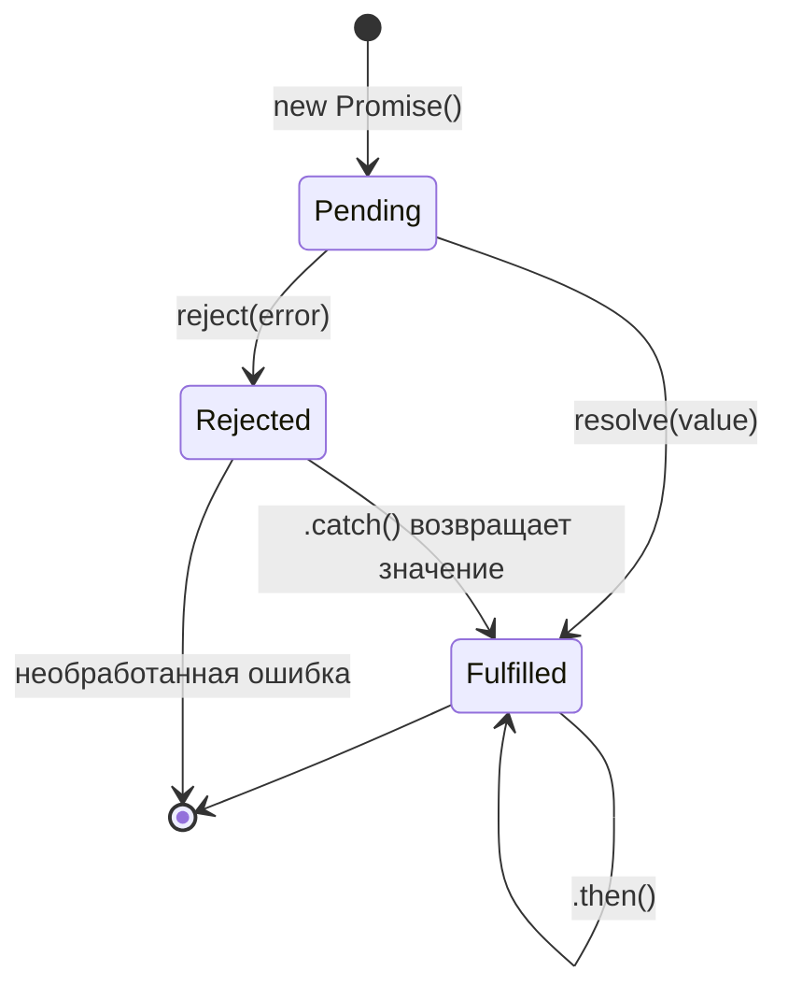

# Promise в JavaScript

Promise — объект, представляющий результат асинхронной операции, который будет доступен в будущем. Это альтернатива callback-функциям, позволяющая писать читаемый асинхронный код.

## Три состояния Promise

- **pending** — начальное состояние, операция ещё выполняется
- **fulfilled** — операция завершилась успешно (`resolve` вызван)
- **rejected** — операция завершилась с ошибкой (`reject` вызван)

Переход из `pending` необратим: Promise нельзя «сбросить» обратно.

## Создание и использование

```js
const fetchUser = new Promise((resolve, reject) => {
  setTimeout(() => {
    const ok = true;
    if (ok) resolve({ id: 1, name: 'Alice' });
    else reject(new Error('User not found'));
  }, 500);
});

fetchUser
  .then(user => console.log(user.name)) // 'Alice'
  .catch(err => console.error(err.message))
  .finally(() => console.log('Request finished'));
```

## Цепочки .then()

```js
fetch('/api/user')
  .then(res => res.json())       // возвращает новый Promise
  .then(user => user.id)         // получает результат предыдущего
  .then(id => fetch(`/api/posts/${id}`))
  .then(res => res.json())
  .catch(err => console.error(err)); // ловит любую ошибку в цепочке
```

## Параллельные запросы

```js
// Promise.all — ждёт все; если хоть один упал — reject
const [user, posts] = await Promise.all([
  fetch('/api/user').then(r => r.json()),
  fetch('/api/posts').then(r => r.json()),
]);

// Promise.allSettled — ждёт все, не прерывается при ошибке
const results = await Promise.allSettled([p1, p2, p3]);
// results[i].status === 'fulfilled' | 'rejected'

// Promise.race — возвращает первый завершившийся (любой)
const fastest = await Promise.race([fetch('/a'), fetch('/b')]);
```

## Схема



## Карточки
- Что такое Promise и какие у него состояния?
- Чем отличается Promise.all от Promise.allSettled и Promise.race?
- Как работают .then(), .catch(), .finally()?
- Как создать Promise вручную?
