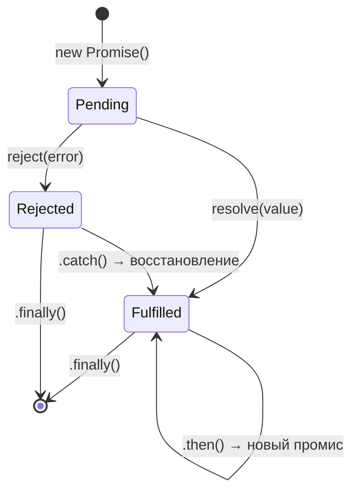

# JavaScript Promises

Promise (промис) — объект, представляющий результат **будущей** асинхронной операции. Это альтернатива callback-функциям, делающая асинхронный код читаемым и предсказуемым.

## Три состояния промиса

| Состояние | Описание |
|-----------|----------|
| `pending` | Операция ещё выполняется |
| `fulfilled` | Операция завершилась успехом |
| `rejected` | Операция завершилась ошибкой |

Переход состояния **необратим**: раз перейдя в `fulfilled` или `rejected`, промис уже не изменится.

## Создание и использование

```js
const promise = new Promise((resolve, reject) => {
  setTimeout(() => {
    const ok = true;
    if (ok) resolve("Данные получены");
    else reject(new Error("Ошибка сервера"));
  }, 1000);
});

promise
  .then(data => console.log(data))   // fulfilled
  .catch(err => console.error(err))  // rejected
  .finally(() => setLoading(false)); // всегда
```

## Цепочки (chaining)

```js
fetchUser(id)
  .then(user => fetchPosts(user.id))  // возвращает новый промис
  .then(posts => renderPosts(posts))
  .catch(err => handleError(err));    // ловит любую ошибку в цепочке
```

Каждый `.then` возвращает **новый промис** — это и есть цепочка.

## Promise.all, Promise.race, Promise.allSettled

```js
// Ждёт все параллельно; падает если хоть один rejected
const [user, posts] = await Promise.all([fetchUser(), fetchPosts()]);

// Возвращает первый завершившийся (fulfilled или rejected)
const fastest = await Promise.race([fast(), slow()]);

// Ждёт все, не падает при ошибках
const results = await Promise.allSettled([req1(), req2()]);
results.forEach(r => {
  if (r.status === "fulfilled") use(r.value);
  else log(r.reason);
});
```

## Схема



## Карточки
- Что такое Promise и какие у него состояния?
- Чем Promise.all отличается от Promise.allSettled?
- Как передать ошибку дальше по цепочке промисов?
- В чём разница между async/await и .then()/.catch()?
