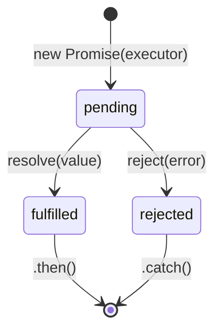

# Promise в JavaScript

`Promise` — объект, представляющий результат асинхронной операции, которого ещё нет, но который появится в будущем (или операция завершится ошибкой).

## Три состояния

Промис всегда находится в одном из трёх состояний и может смениться только один раз — с `pending` на `fulfilled` либо `rejected`. Обратного пути нет.

- **pending** — начальное состояние, результат ещё не готов
- **fulfilled** — операция завершилась успешно, есть значение
- **rejected** — операция завершилась с ошибкой

```js
const promise = new Promise((resolve, reject) => {
  fetchData()
    .then(data => resolve(data))
    .catch(err => reject(err));
});
```

## Обработка результата

```js
promise
  .then(data => console.log('Успех:', data))
  .catch(err => console.error('Ошибка:', err))
  .finally(() => console.log('В любом случае выполнится'));
```

`.then()` и `.catch()` возвращают **новый промис**, поэтому их можно объединять в цепочку — каждый следующий `.then()` получает результат предыдущего.

## async/await — синтаксический сахар

```js
async function loadUser() {
  try {
    const data = await fetchData(); // ждём, пока промис resolve
    console.log('Успех:', data);
  } catch (err) {
    console.error('Ошибка:', err);
  }
}
```

`await` можно использовать только внутри функции с модификатором `async`. Под капотом это всё те же промисы — `await` просто «разворачивает» их синхронно на вид.

## Комбинирование нескольких промисов

- `Promise.all([...])` — ждёт **все** промисы, падает, если хоть один rejected
- `Promise.allSettled([...])` — ждёт все, но не падает — возвращает статус каждого
- `Promise.race([...])` — возвращает результат **первого** завершившегося промиса
- `Promise.any([...])` — возвращает первый **успешный** результат

## Схема



## Карточки

- В каком порядке выполняются Promise.then() и setTimeout()?
- Чем async/await отличается от .then()/.catch()?
- Чем Promise.all отличается от Promise.allSettled?
- Может ли промис поменять состояние дважды?
