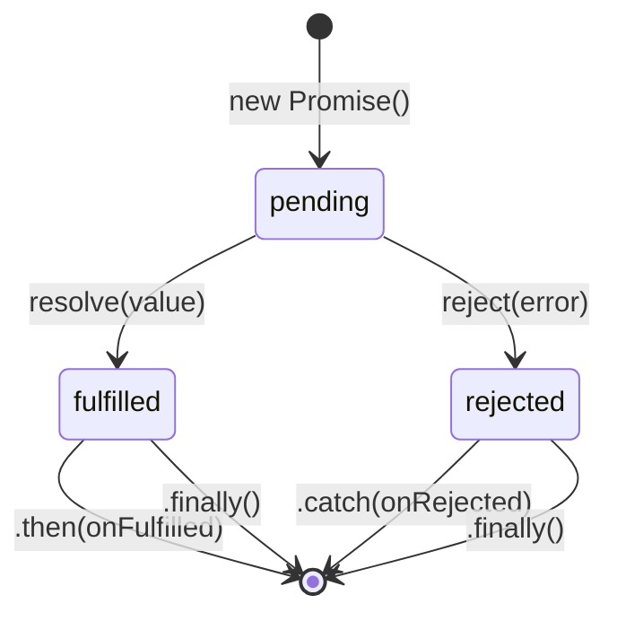

# Promise в JavaScript

**Promise** (промис) — объект, представляющий результат асинхронной операции, которая ещё не завершена. Это альтернатива «callback hell» — вложенным колбэкам.

## Состояния Promise

Promise находится в одном из трёх состояний:

- **pending** — операция ещё выполняется
- **fulfilled** — успешно завершилась, результат доступен
- **rejected** — завершилась с ошибкой

После перехода в `fulfilled` или `rejected` состояние не меняется.

## Создание Promise

```js
const promise = new Promise((resolve, reject) => {
  setTimeout(() => {
    const success = true;
    if (success) {
      resolve("Данные получены"); // fulfilled
    } else {
      reject(new Error("Ошибка запроса")); // rejected
    }
  }, 1000);
});
```

## Цепочка .then()

```js
fetch('/api/users')
  .then(res => res.json())              // преобразовать ответ
  .then(users => users.filter(u => u.active)) // обработать
  .then(active => console.log(active))
  .catch(err => console.error(err))     // поймать любую ошибку
  .finally(() => console.log("Готово")); // всегда выполняется
```

## async / await

`async/await` — синтаксический сахар над Promise. Код выглядит синхронным, но остаётся асинхронным.

```js
async function loadUsers() {
  try {
    const res = await fetch('/api/users');
    const users = await res.json();
    return users.filter(u => u.active);
  } catch (err) {
    console.error("Ошибка:", err);
  } finally {
    console.log("Запрос завершён");
  }
}
```

## Promise.all, Promise.race, Promise.allSettled

```js
// Promise.all — ждёт ВСЕ; если один rejected — всё упадёт
const [users, posts] = await Promise.all([
  fetch('/api/users').then(r => r.json()),
  fetch('/api/posts').then(r => r.json()),
]);

// Promise.race — возвращает результат ПЕРВОГО завершившегося
const result = await Promise.race([
  fetch('/api/fast'),
  new Promise((_, reject) => setTimeout(() => reject("timeout"), 5000)),
]);

// Promise.allSettled — ждёт все, не бросает ошибку
const results = await Promise.allSettled([p1, p2, p3]);
// [{ status: 'fulfilled', value: ... }, { status: 'rejected', reason: ... }]
```

## Схема



## Карточки

- Что такое Promise и чем async/await отличается от .then()?
- Как работает Promise.all и чем отличается от Promise.allSettled?
- Что такое "callback hell" и как Promise решает эту проблему?
