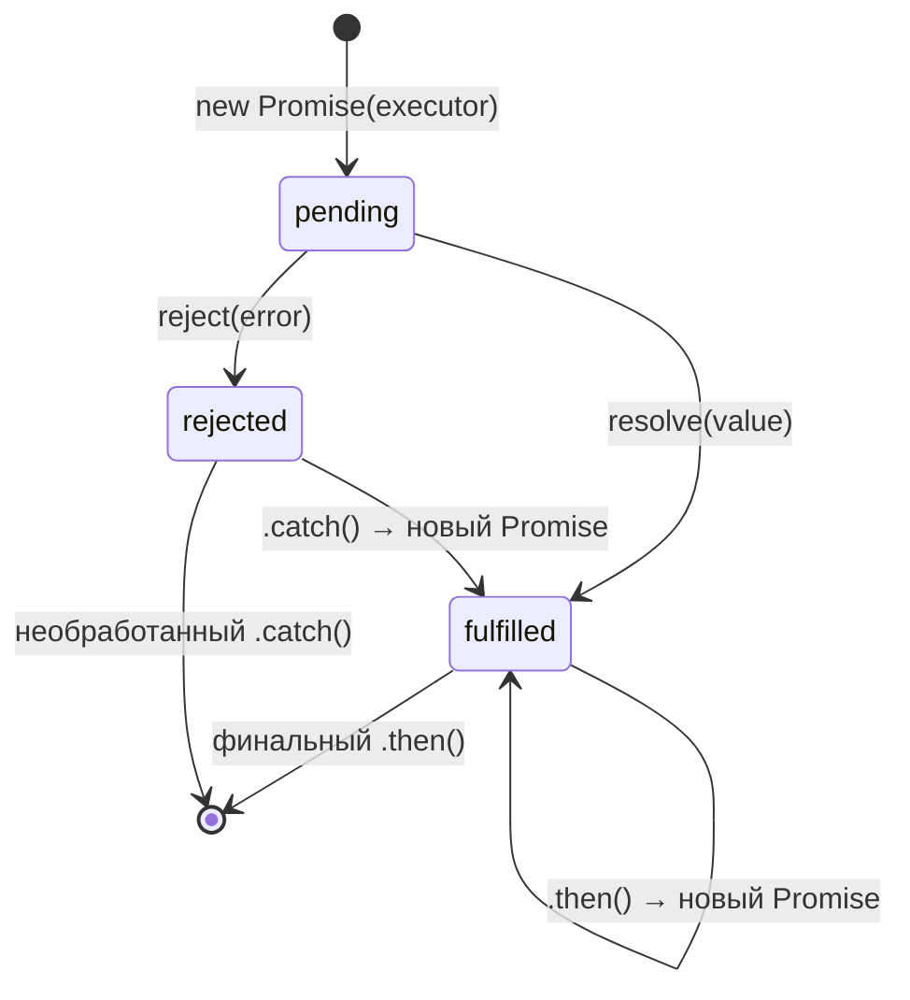

# JavaScript Promises

Promise (промис) — объект, представляющий результат асинхронной операции. Позволяет писать асинхронный код без «callback hell» и удобно цеплять операции через `.then()`.

## Состояния

Промис создаётся в состоянии `pending` и переходит в одно из финальных состояний — переход **необратим**:

- **pending** — операция выполняется
- **fulfilled** — завершилась успешно, есть результат
- **rejected** — завершилась с ошибкой

## Создание и базовое использование

```js
const fetchUser = (id) => new Promise((resolve, reject) => {
  if (id > 0) {
    resolve({ id, name: "Alice" });
  } else {
    reject(new Error("Invalid ID"));
  }
});

fetchUser(1)
  .then(user => console.log(user.name))   // "Alice"
  .catch(err => console.error(err.message))
  .finally(() => console.log("Готово"));  // всегда выполняется
```

## Цепочка промисов

Каждый `.then()` возвращает новый промис, что позволяет выстраивать последовательные операции:

```js
fetch("/api/user/1")
  .then(res => res.json())
  .then(user => fetch(`/api/posts?userId=${user.id}`))
  .then(res => res.json())
  .then(posts => console.log(posts))
  .catch(err => console.error(err)); // ловит ошибки из любого шага
```

## Комбинаторы

```js
// Promise.all — ждёт ВСЕ; если один rejected — весь rejected
const [users, posts] = await Promise.all([
  fetch("/api/users").then(r => r.json()),
  fetch("/api/posts").then(r => r.json()),
]);

// Promise.allSettled — ждёт все, не падает при ошибке
const results = await Promise.allSettled([p1, p2, p3]);
// results[i].status === "fulfilled" | "rejected"

// Promise.race — возвращает первый завершившийся (любой)
const result = await Promise.race([fetchData(), timeout(3000)]);

// Promise.any — возвращает первый fulfilled (игнорирует rejected)
const fastest = await Promise.any([mirror1, mirror2, mirror3]);
```

## Схема



## Карточки

- Что такое Promise и какие у него состояния?
- Как обработать ошибку в цепочке промисов?
- В чём разница между Promise.all и Promise.allSettled?
- Что возвращает каждый вызов .then()?
- Когда использовать Promise.race?
