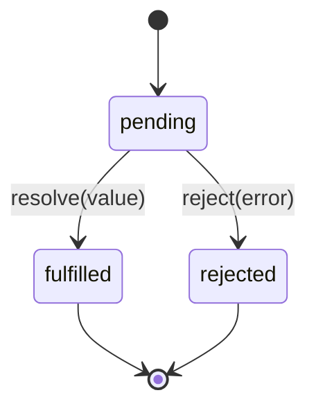

# Promises и асинхронность в JavaScript

`Promise` — объект, представляющий результат операции, которая завершится **не сейчас, а когда-нибудь**: успешно (`fulfilled`) или с ошибкой (`rejected`). До этого он находится в состоянии `pending`.

## Три состояния

Промис может сменить состояние только один раз — из `pending` в `fulfilled` или `rejected`, и обратно уже не вернётся.

```js
const promise = new Promise((resolve, reject) => {
  const success = Math.random() > 0.5;
  setTimeout(() => {
    success ? resolve('done') : reject(new Error('failed'));
  }, 1000);
});
```

## Схема


```mermaid
stateDiagram-v2
  [*] --> pending
  pending --> fulfilled: resolve(value)
  pending --> rejected: reject(error)
  fulfilled --> [*]
  rejected --> [*]
```

## Цепочки .then/.catch/.finally

```js
fetch('/api/user')
  .then(res => res.json())
  .then(data => console.log(data))
  .catch(err => console.error('Ошибка:', err))
  .finally(() => console.log('Запрос завершён'));
```

Каждый `.then()` возвращает **новый промис**, поэтому вызовы можно выстраивать в цепочку. Если в любом из них выбросить ошибку — управление сразу переходит в ближайший `.catch()`.

## async/await — синтаксический сахар

```js
async function loadUser() {
  try {
    const res = await fetch('/api/user');
    const data = await res.json();
    return data;
  } catch (err) {
    console.error('Ошибка:', err);
  }
}
```

`await` можно использовать только внутри `async`-функции. Он «замораживает» выполнение именно этой функции (не всей программы) до разрешения промиса.

## Promise.all vs Promise.allSettled vs Promise.race

```js
// Все должны выполниться успешно, иначе весь Promise.all упадёт
const [users, posts] = await Promise.all([
  fetch('/api/users').then(r => r.json()),
  fetch('/api/posts').then(r => r.json()),
]);

// Ждёт все, но не падает при ошибке — возвращает статус каждого
const results = await Promise.allSettled([promiseA, promiseB]);

// Возвращает результат самого быстрого промиса
const first = await Promise.race([promiseA, promiseB]);
```

## Типичная ошибка

```js
// Забыли await — получаем Promise, а не данные
async function getUser() {
  const data = fetch('/api/user').then(r => r.json());
  console.log(data); // Promise {<pending>}
}

// Правильно
async function getUser() {
  const data = await fetch('/api/user').then(r => r.json());
  console.log(data); // реальные данные
}
```

## Карточки

- Что такое Promise и чем async/await отличается от .then()?
- Чем async/await отличается от .then()/.catch()?
- Какие три состояния может принимать Promise?
- В чём разница между Promise.all и Promise.allSettled?
