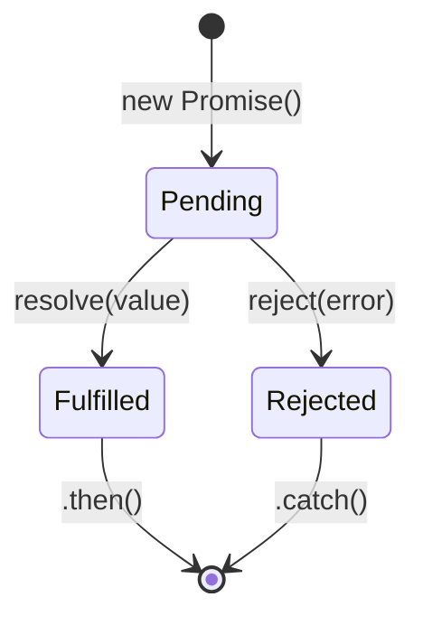

# Promises (Промисы)

Promise — это объект, представляющий результат асинхронной операции, который **ещё не готов сейчас, но будет готов в будущем** (или завершится ошибкой).

## Три состояния

Промис всегда находится в одном из трёх состояний:

- **pending** — операция ещё выполняется
- **fulfilled** — операция успешно завершена, есть результат
- **rejected** — операция завершилась ошибкой

Как только промис перешёл в fulfilled или rejected, его состояние **больше не меняется** — это называется «settled» (устоявшийся).

```js
const promise = new Promise((resolve, reject) => {
  setTimeout(() => {
    const success = true;
    success ? resolve("Данные получены") : reject("Ошибка загрузки");
  }, 1000);
});

promise
  .then((result) => console.log(result))
  .catch((error) => console.error(error))
  .finally(() => console.log("Запрос завершён"));
```

## Схема


```mermaid
stateDiagram-v2
  [*] --> Pending: new Promise()
  Pending --> Fulfilled: resolve(value)
  Pending --> Rejected: reject(error)
  Fulfilled --> [*]: .then()
  Rejected --> [*]: .catch()
```

## Цепочки промисов

`.then()` возвращает новый промис, поэтому вызовы можно выстраивать в цепочку — каждый следующий `.then()` получает результат предыдущего.

```js
fetch("/api/user")
  .then((res) => res.json())
  .then((user) => fetch(`/api/orders?user=${user.id}`))
  .then((res) => res.json())
  .then((orders) => console.log(orders))
  .catch((err) => console.error("Ошибка в цепочке:", err));
```

Ошибка на любом шаге пропускает оставшиеся `.then()` и сразу попадает в ближайший `.catch()`.

## Promise.all, Promise.race, Promise.allSettled

```js
// Ждём ВСЕ промисы, падаем при первой же ошибке
Promise.all([fetchUsers(), fetchOrders()])
  .then(([users, orders]) => console.log(users, orders));

// Берём результат того, кто завершится первым
Promise.race([fetchFast(), fetchSlow()])
  .then((first) => console.log(first));

// Ждём ВСЕ промисы, ошибки не прерывают выполнение
Promise.allSettled([fetchUsers(), fetchOrders()])
  .then((results) => results.forEach((r) => console.log(r.status)));
```

## async/await — синтаксический сахар над промисами

`async/await` не заменяет промисы, а лишь позволяет писать асинхронный код в синхронном стиле. Под капотом всё та же цепочка `.then()`.

```js
async function loadUser() {
  try {
    const res = await fetch("/api/user");
    const user = await res.json();
    return user;
  } catch (err) {
    console.error("Не удалось загрузить пользователя:", err);
  }
}
```

## Типичная ошибка junior-разработчика

```js
// Забыли return — следующий .then() получит undefined
promise.then((data) => {
  processData(data); // результат потерян
});

// Правильно
promise.then((data) => {
  return processData(data);
});
```

## Карточки

- Какие три состояния может иметь промис и чем они отличаются?
- Чем отличается Promise.all от Promise.allSettled?
- Что произойдёт, если внутри цепочки .then() выбросить ошибку?
- Что делает async/await «под капотом»?
- Почему важно возвращать (return) значение внутри .then()?
