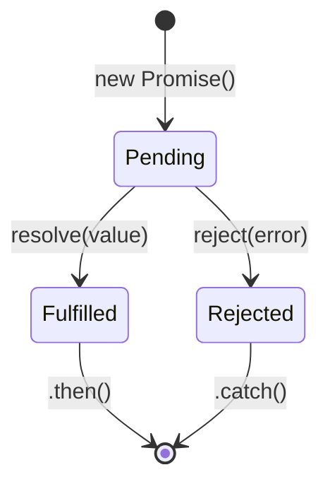

# Promises (Промисы)

Promise — это объект, представляющий результат асинхронной операции, которого ещё может не быть. Он решает проблему "callback hell", позволяя выстраивать асинхронный код цепочками вместо вложенных колбэков.

## Три состояния

У промиса всегда одно из трёх состояний, и переход **необратим** — один раз "устоявшись" (settled), промис уже не может сменить состояние:

- **pending** — операция ещё выполняется
- **fulfilled** — операция завершилась успешно, есть значение
- **rejected** — операция завершилась с ошибкой

```js
const promise = new Promise((resolve, reject) => {
  fetchData()
    .then((data) => resolve(data))
    .catch((err) => reject(err));
});
```

## Схема


```mermaid
stateDiagram-v2
  [*] --> Pending: new Promise()
  Pending --> Fulfilled: resolve(value)
  Pending --> Rejected: reject(error)
  Fulfilled --> [*]: .then()
  Rejected --> [*]: .catch()
```

## Цепочки и обработка ошибок

Каждый `.then()` возвращает **новый** промис, поэтому цепочки можно выстраивать последовательно, а ошибку — ловить один раз в конце:

```js
fetchUser(id)
  .then((user) => fetchOrders(user.id))
  .then((orders) => orders.filter((o) => o.status === "active"))
  .catch((err) => console.error("Что-то упало:", err));
```

Ошибка из любого шага цепочки "провалится" вниз до ближайшего `.catch()`, минуя промежуточные `.then()`.

## Promise.all, race, allSettled

**`Promise.all`** — ждёт все промисы, но падает целиком, если хотя бы один rejected:

```js
const [users, posts] = await Promise.all([fetchUsers(), fetchPosts()]);
```

**`Promise.allSettled`** — ждёт все, но никогда не падает: возвращает статус каждого:

```js
const results = await Promise.allSettled([fetchUsers(), fetchPosts()]);
// [{ status: "fulfilled", value: [...] }, { status: "rejected", reason: Error }]
```

**`Promise.race`** — возвращает результат того промиса, который устоится первым:

```js
const result = await Promise.race([fetchData(), timeout(3000)]);
// удобно для реализации таймаута запроса
```

## async/await — это просто синтаксис поверх промисов

```js
// то же самое, что и .then()-цепочка выше
async function loadActiveOrders(id) {
  try {
    const user = await fetchUser(id);
    const orders = await fetchOrders(user.id);
    return orders.filter((o) => o.status === "active");
  } catch (err) {
    console.error("Что-то упало:", err);
  }
}
```

`await` "разворачивает" промис и приостанавливает выполнение функции, пока он не устоится — но при этом не блокирует основной поток: остальной JS-код продолжает выполняться через event loop.

## Типичные ошибки

**Забыть `return` в `.then()`** — цепочка ломается, следующий `.then()` получает `undefined`:

```js
fetchUser(id).then((user) => {
  fetchOrders(user.id); // забыли return!
}).then((orders) => {
  console.log(orders); // undefined
});
```

**Промис без `.catch()`** — необработанный `reject` уйдёт в `unhandledrejection` и может уронить приложение в Node.js.

## Карточки

- Какие три состояния бывают у промиса и может ли он вернуться в pending?
- Чем `Promise.all` отличается от `Promise.allSettled`?
- Для чего нужен `Promise.race` и как с его помощью сделать таймаут запроса?
- Что произойдёт, если забыть `return` внутри `.then()`?
- Как async/await связаны с промисами и event loop?
