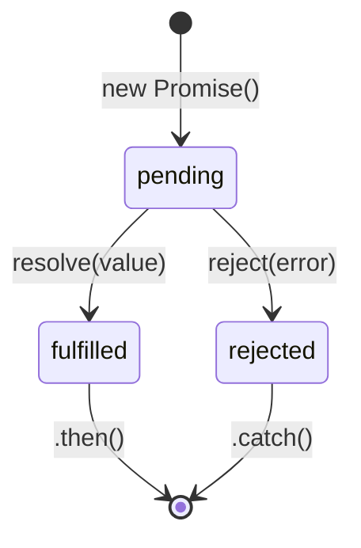

# Promises в JavaScript

`Promise` — объект-обёртка над результатом асинхронной операции, который в итоге принимает одно из трёх состояний.

## Три состояния

- **pending** — операция ещё не завершена
- **fulfilled** — операция завершилась успешно, есть значение
- **rejected** — операция завершилась с ошибкой

Состояние промиса меняется **только один раз** и необратимо: из `pending` можно перейти в `fulfilled` или `rejected`, но не наоборот.

```js
const promise = new Promise((resolve, reject) => {
  const success = Math.random() > 0.5;
  setTimeout(() => {
    success ? resolve("данные загружены") : reject(new Error("ошибка сети"));
  }, 1000);
});
```

## Схема


```mermaid
stateDiagram-v2
    [*] --> pending: new Promise()
    pending --> fulfilled: resolve(value)
    pending --> rejected: reject(error)
    fulfilled --> [*]: .then()
    rejected --> [*]: .catch()
```

## Цепочки .then()

Каждый `.then()` возвращает **новый** промис, поэтому вызовы можно выстраивать в цепочку.

```js
fetch("/api/user")
  .then(res => res.json())
  .then(user => fetch(`/api/orders/${user.id}`))
  .then(res => res.json())
  .then(orders => console.log(orders))
  .catch(err => console.error("Ошибка на любом шаге:", err));
```

**Важно:** если забыть `return` внутри `.then()`, следующий шаг цепочки получит `undefined` вместо ожидаемого значения.

```js
// Неправильно — вложенность вместо цепочки, легко забыть return
promise.then(data => {
  fetch(url).then(res => { /* результат теряется */ });
});
```

## Promise.all, race, allSettled, any

```js
// all — ждёт все, падает при первой ошибке
Promise.all([p1, p2, p3]).then(([r1, r2, r3]) => { /* ... */ });

// allSettled — ждёт все, никогда не падает
Promise.allSettled([p1, p2, p3]).then(results => {
  results.forEach(r => console.log(r.status)); // "fulfilled" | "rejected"
});

// race — возвращает результат первого завершившегося
Promise.race([p1, p2]).then(first => { /* ... */ });

// any — возвращает первый успешный, падает только если все отклонены
Promise.any([p1, p2]).then(firstSuccess => { /* ... */ });
```

## async/await — синтаксический сахар

```js
async function loadUser() {
  try {
    const res = await fetch("/api/user");
    const user = await res.json();
    return user;
  } catch (err) {
    console.error(err);
  }
}
```

`await` можно использовать только внутри `async`-функции. Под капотом это всё те же промисы — `async function` всегда возвращает промис.

## Частые ошибки

- Забыть `.catch()` — необработанный rejection может уронить процесс в Node.js
- Смешивать `await` с `.then()` в одном месте без необходимости
- Использовать `Promise.all` там, где нужен `allSettled` — одна ошибка обрывает все остальные результаты
- Создавать промис через `new Promise()` там, где уже есть промис-совместимая функция (антипаттерн "Promise constructor")

## Карточки

- Что такое Promise и чем async/await отличается от .then()?
- Какие три состояния может принимать Promise?
- Чем Promise.all отличается от Promise.allSettled?
- Что произойдёт, если забыть return внутри .then()?
- Почему await можно использовать только внутри async-функции?
