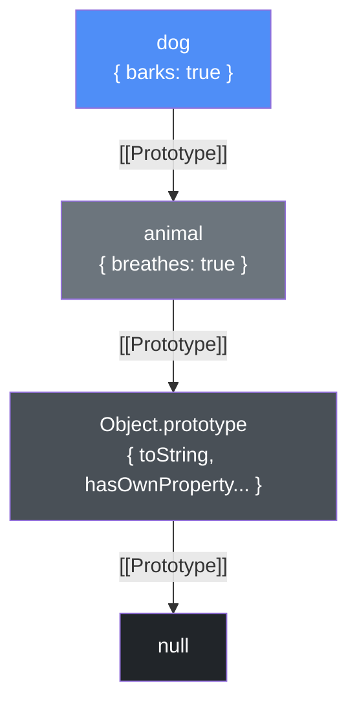

# Прототипы в JavaScript

В JavaScript нет классического наследования как в Java или C++. Вместо этого используется **прототипное наследование**: каждый объект имеет скрытую ссылку `[[Prototype]]` на другой объект, у которого ищутся свойства, если они не найдены в текущем.

## Как работает поиск свойства

При обращении к `obj.prop` движок JS:
1. Ищет `prop` в самом `obj`.
2. Если не найдено — переходит в `obj[[Prototype]]`.
3. Продолжает вверх по цепочке до `null` (конец цепочки).

```js
const animal = { breathes: true };
const dog = Object.create(animal); // dog.__proto__ === animal
dog.barks = true;

console.log(dog.breathes); // true — найдено в прототипе
console.log(dog.barks);    // true — найдено в самом объекте
console.log(dog.hasOwnProperty('breathes')); // false
```

## Классы — синтаксический сахар

```js
class Animal {
  constructor(name) { this.name = name; }
  speak() { return `${this.name} makes a sound.`; }
}

class Dog extends Animal {
  speak() { return `${this.name} barks.`; }
}

const d = new Dog('Rex');
console.log(d.speak()); // "Rex barks."
```

Под капотом `Dog.prototype.__proto__ === Animal.prototype`. Ключевое слово `class` не создаёт новой системы — это удобная обёртка над прототипами.

## Object.create vs new

```js
// Object.create — явно задаёт прототип объекта
const dog = Object.create(animal);

// new — создаёт объект, где [[Prototype]] = ClassName.prototype
const d = new Dog('Rex');

// Проверка цепочки
console.log(d instanceof Dog);    // true
console.log(d instanceof Animal); // true
```

## Схема



## Карточки
- Что такое цепочка прототипов в JavaScript?
- Чем отличается `Object.create()` от `new`?
- Как классы ES6 связаны с прототипами под капотом?
