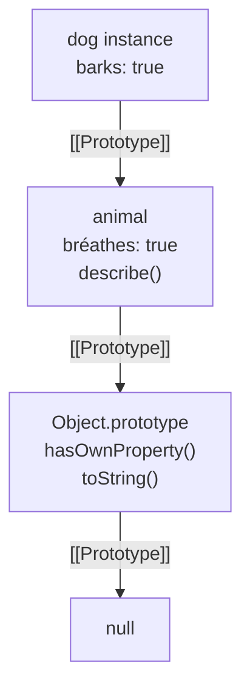

# Цепочка прототипов в JavaScript

В JavaScript каждый объект имеет внутреннюю ссылку `[[Prototype]]` на другой объект — его прототип. Через эту цепочку реализуется наследование: если свойство не найдено в самом объекте, движок ищет его выше по цепочке вплоть до `Object.prototype`, у которого `[[Prototype]]` равен `null`.

## Как работает поиск свойства

```js
const animal = {
  breathes: true,
  describe() { return `I breathe: ${this.breathes}`; }
};

const dog = Object.create(animal);
dog.barks = true;

console.log(dog.breathes);                    // true  (из прототипа)
console.log(dog.hasOwnProperty('breathes'));  // false (не собственное)
console.log(dog.describe());                  // "I breathe: true"
```

`Object.create(proto)` создаёт новый объект и устанавливает `proto` в качестве его прототипа.

## Классы — синтаксический сахар

Классы ES6 не меняют прототипную модель, они просто делают её запись удобнее:

```js
class Animal {
  constructor(name) { this.name = name; }
  speak() { return `${this.name} makes a sound`; }
}

class Dog extends Animal {
  speak() { return `${this.name} barks`; }
}

const d = new Dog('Rex');
console.log(d.speak());           // "Rex barks"
console.log(d instanceof Animal); // true
```

`extends` автоматически выстраивает цепочку: `Dog.prototype` → `Animal.prototype` → `Object.prototype` → `null`.

## Собственные свойства vs унаследованные

```js
for (const key in dog) {
  if (dog.hasOwnProperty(key)) {
    console.log('own:', key);       // own: barks
  } else {
    console.log('inherited:', key); // inherited: breathes, describe
  }
}
```

Используйте `hasOwnProperty` или `Object.keys()` когда важно работать только с собственными свойствами объекта.

## Схема



## Карточки
- Что такое цепочка прототипов в JavaScript?
- Как `Object.create()` связан с прототипами?
- В чём разница между собственным свойством и унаследованным?
