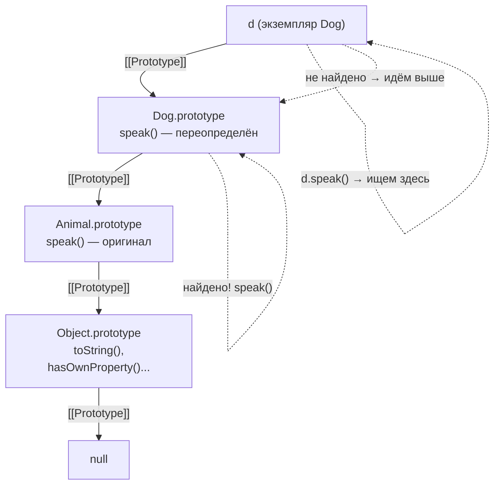

# JavaScript: Цепочка прототипов

В JavaScript наследование реализуется через **прототипы**. Каждый объект имеет внутреннюю ссылку `[[Prototype]]` на другой объект. При поиске свойства JS сначала проверяет сам объект, затем поднимается по цепочке прототипов вплоть до `null`.

## Как это работает

```js
const animal = { breathes: true };
const dog = Object.create(animal);
dog.name = 'Rex';

console.log(dog.name);      // 'Rex'  — собственное свойство
console.log(dog.breathes);  // true   — из прототипа animal
console.log(Object.getPrototypeOf(dog) === animal); // true

// Конец цепочки
console.log(Object.getPrototypeOf(animal) === Object.prototype); // true
console.log(Object.getPrototypeOf(Object.prototype)); // null
```

## Классы — синтаксический сахар

```js
class Animal {
  constructor(name) { this.name = name; }
  speak() { return `${this.name} makes a sound.`; }
}

class Dog extends Animal {
  speak() { return `${this.name} barks.`; }
}

const d = new Dog('Rex');
d.speak();           // 'Rex barks.'  — переопределённый метод
d instanceof Animal; // true — проверка через цепочку прототипов
```

Под капотом `extends` устанавливает: `Dog.prototype.__proto__ === Animal.prototype`.

## Проверка собственных свойств

```js
console.log(d.hasOwnProperty('name'));  // true  — своё
console.log(d.hasOwnProperty('speak')); // false — из прототипа
```

## Схема



## Карточки
- Что такое цепочка прототипов (prototype chain) в JavaScript?
- Чем `class`/`extends` отличается от прямого использования прототипов?
- Как проверить, является ли свойство собственным, а не унаследованным?
