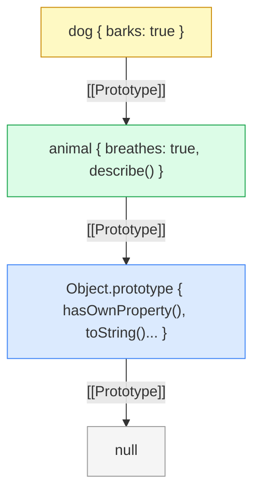

# Цепочка прототипов JavaScript

В JavaScript каждый объект имеет скрытую ссылку `[[Prototype]]`, которая указывает на другой объект — его прототип. При обращении к свойству движок JS последовательно обходит эту цепочку снизу вверх, пока не найдёт нужное свойство или не достигнет `null`.

## Как это работает

Когда ты пишешь `obj.prop`, JS делает следующее:

1. Ищет `prop` в самом объекте `obj`
2. Если не нашёл — переходит к `obj[[Prototype]]`
3. Продолжает вверх по цепочке
4. Если достиг `Object.prototype` и не нашёл — возвращает `undefined`

```js
const animal = {
  breathes: true,
  describe() {
    return `Я дышу: ${this.breathes}`;
  }
};

const dog = Object.create(animal); // dog[[Prototype]] = animal
dog.barks = true;

console.log(dog.barks);       // true — собственное свойство
console.log(dog.breathes);    // true — из прототипа animal
console.log(dog.describe());  // "Я дышу: true" — метод из прототипа

console.log(Object.getPrototypeOf(dog) === animal); // true
console.log(dog.hasOwnProperty('barks'));     // true
console.log(dog.hasOwnProperty('breathes')); // false
```

## Прототипы и классы ES6

Синтаксис `class` — это синтаксический сахар над прототипами:

```js
class Animal {
  constructor(name) {
    this.name = name;
  }
  speak() {
    return `${this.name} издаёт звук`;
  }
}

class Dog extends Animal {
  bark() {
    return `${this.name} лает!`;
  }
}

const d = new Dog('Рекс');
d.bark();  // "Рекс лает!"
d.speak(); // "Рекс издаёт звук" — из Animal.prototype
```

`extends` автоматически выстраивает цепочку прототипов: `Dog.prototype[[Prototype]] = Animal.prototype`.

## Схема



## Карточки
- Что такое цепочка прототипов в JavaScript?
- Как проверить, что свойство принадлежит самому объекту, а не прототипу?
- Чем отличается `Object.create(proto)` от `new Constructor()`?
