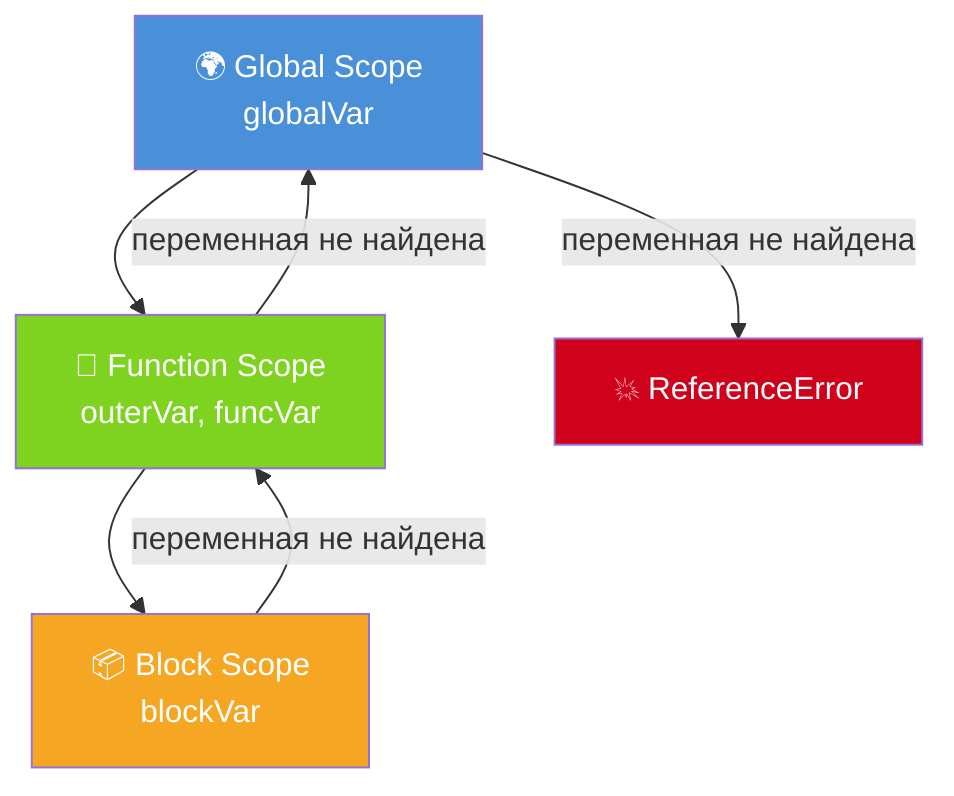

# Область видимости в JavaScript (Scope)

**Scope** (область видимости) — контекст, в котором переменная доступна. JavaScript использует **лексическую область видимости**: она определяется местом объявления в коде, а не местом вызова.

## Виды областей видимости

**Глобальная (Global Scope)** — переменные объявлены вне функций и доступны везде.

**Функциональная (Function Scope)** — переменные, объявленные внутри функции, доступны только в ней.

**Блочная (Block Scope)** — `let` и `const` ограничены блоком `{}`. `var` блоки игнорирует — работает на уровне функции.

```js
var globalVar = 'global'; // глобальная

function outer() {
  let outerVar = 'outer'; // функциональная

  if (true) {
    let blockVar = 'block'; // блочная — только внутри if
    var funcVar  = 'func';  // функциональная — видна всей outer()
    console.log(outerVar);  // ✓ 'outer'
  }

  console.log(funcVar);    // ✓ 'func'
  console.log(blockVar);   // ✗ ReferenceError
}

function other() {
  console.log(globalVar);  // ✓ 'global'
  console.log(outerVar);   // ✗ ReferenceError
}
```

## Цепочка областей видимости (Scope Chain)

Когда JS не находит переменную в текущей области, он поднимается выше — до глобальной.

```js
const x = 'global';

function outer() {
  const x = 'outer';

  function inner() {
    // нет своего x — берёт из outer
    console.log(x); // 'outer'
  }

  inner();
}
```

## Схема



## Замыкание и scope

Замыкание — функция, которая «помнит» лексическую область, в которой была создана:

```js
function makeCounter() {
  let count = 0;

  return function() {
    count++;
    return count;
  };
}

const counter = makeCounter();
counter(); // 1
counter(); // 2
// count живёт в замыкании и недоступен снаружи
```

## Карточки

- Чем отличается `var` от `let`/`const` по области видимости?
- Что такое Scope Chain в JavaScript?
- Что такое лексическая область видимости?
- Может ли вложенная функция обращаться к переменным внешней функции?
- Что такое hoisting в JavaScript?
