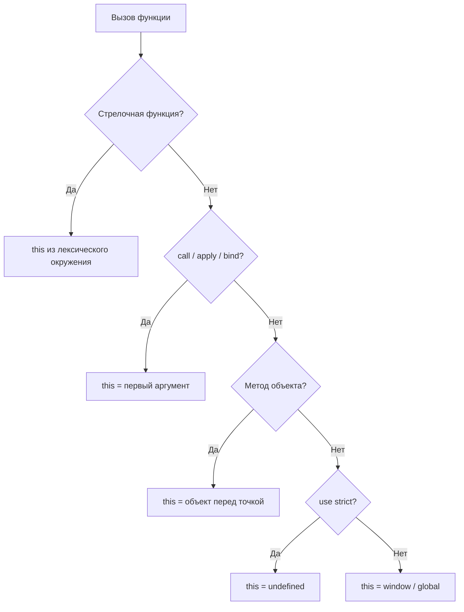

# Ключевое слово `this` в JavaScript

`this` — одно из самых запутанных понятий в JS. Его значение **не задаётся при объявлении** функции — оно определяется в момент **вызова**.

## Правила определения `this`

### 1. Глобальный контекст

Вне функций `this` = `window` (в браузере). В строгом режиме (`'use strict'`) — `undefined`.

```js
console.log(this); // window
```

### 2. Метод объекта

Если функция вызывается как свойство объекта, `this` = этот объект.

```js
const user = {
  name: 'Alice',
  greet() {
    console.log(this.name); // 'Alice'
  },
};
user.greet();
```

### 3. Явная привязка через call / apply / bind

```js
function greet() {
  console.log(this.name);
}

greet.call({ name: 'Bob' });   // 'Bob'
greet.apply({ name: 'Eve' });  // 'Eve'

const greetBob = greet.bind({ name: 'Bob' });
greetBob(); // 'Bob'
```

`call` и `apply` вызывают сразу; `bind` возвращает новую функцию с зафиксированным `this`.

### 4. Стрелочные функции

Стрелочные функции **не имеют собственного `this`** — они захватывают его из лексического окружения (где функция *объявлена*).

```js
const obj = {
  name: 'Charlie',
  // Проблема: обычная функция в setTimeout теряет this
  greetWrong() {
    setTimeout(function () {
      console.log(this.name); // undefined (this = window)
    }, 100);
  },
  // Решение: стрелочная функция захватывает this метода
  greetRight() {
    setTimeout(() => {
      console.log(this.name); // 'Charlie'
    }, 100);
  },
};
```

## Схема



## Типичные ошибки

**Потеря контекста при передаче метода:**

```js
const user = {
  name: 'Alice',
  greet() { console.log(this.name); },
};

const fn = user.greet;
fn(); // undefined — this потерян!

// Фикс:
const fn = user.greet.bind(user);
fn(); // 'Alice'
```

**Стрелочная функция как метод:**

```js
const user = {
  name: 'Alice',
  greet: () => console.log(this.name), // this = window, не user!
};
user.greet(); // undefined
```

## Карточки

- Что такое `this` в JavaScript?
- Чем отличается `this` в стрелочной функции от обычной?
- Как явно задать `this` при вызове функции?
- Чему равно `this` в строгом режиме вне объекта?
- Почему теряется `this` при передаче метода как коллбека?
