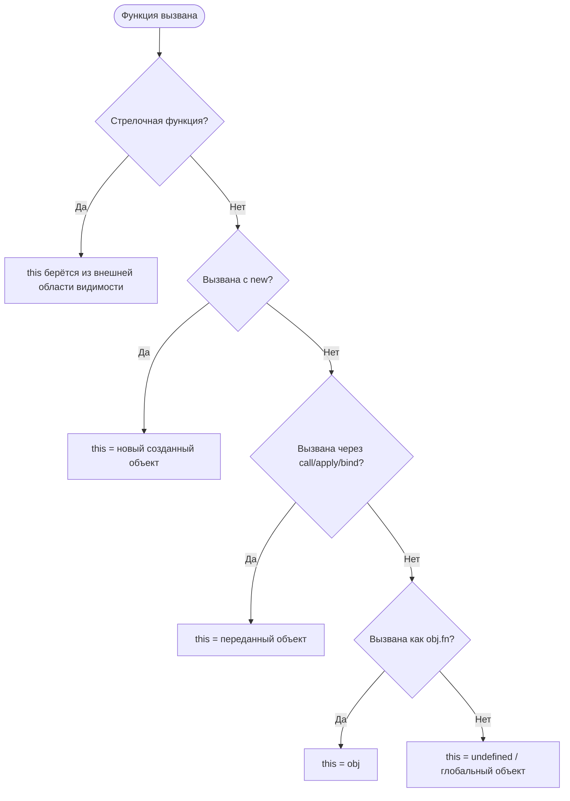

# this в JavaScript

`this` — специальное значение, которое определяется не там, где функция **объявлена**, а там, где она **вызывается** (кроме стрелочных функций). Это одна из самых частых причин багов у junior-разработчиков.

## Четыре правила определения this

**1. Обычный вызов (default binding)** — `this` равен `undefined` в strict mode (или глобальному объекту без strict mode):

```js
function show() {
  console.log(this);
}
show(); // undefined (strict mode)
```

**2. Вызов через объект (implicit binding)** — `this` равен объекту перед точкой:

```js
const user = {
  name: 'Bob',
  greet() { console.log(this.name); }
};
user.greet(); // 'Bob'
```

**3. Явное указание (explicit binding)** — через `call`, `apply`, `bind`:

```js
function greet() { console.log(this.name); }
greet.call({ name: 'Alice' }); // 'Alice'
```

**4. Вызов через new (new binding)** — `this` равен новому создаваемому объекту:

```js
function User(name) { this.name = name; }
const u = new User('Eve'); // this === u
```

**Стрелочные функции** не имеют собственного `this` — они берут его из внешней (лексической) области видимости, где были объявлены:

```js
const obj = {
  name: 'Team',
  regular: function () {
    setTimeout(function () {
      console.log(this.name); // undefined — this потерялся
    }, 0);
  },
  arrow: function () {
    setTimeout(() => {
      console.log(this.name); // 'Team' — this взят снаружи
    }, 0);
  }
};
```

## Схема


```mermaid
flowchart TD
    A([Функция вызвана]) --> B{Стрелочная функция?}
    B -- Да --> C[this берётся из внешней области видимости]
    B -- Нет --> D{Вызвана с new?}
    D -- Да --> E[this = новый созданный объект]
    D -- Нет --> F{Вызвана через call/apply/bind?}
    F -- Да --> G[this = переданный объект]
    F -- Нет --> H{Вызвана как obj.fn?}
    H -- Да --> I[this = obj]
    H -- Нет --> J[this = undefined / глобальный объект]
```

## Карточки

- Чем отличаются call, apply и bind?
- Как работает this в стрелочных функциях?
- Что выведет this при обычном вызове функции в strict mode?
