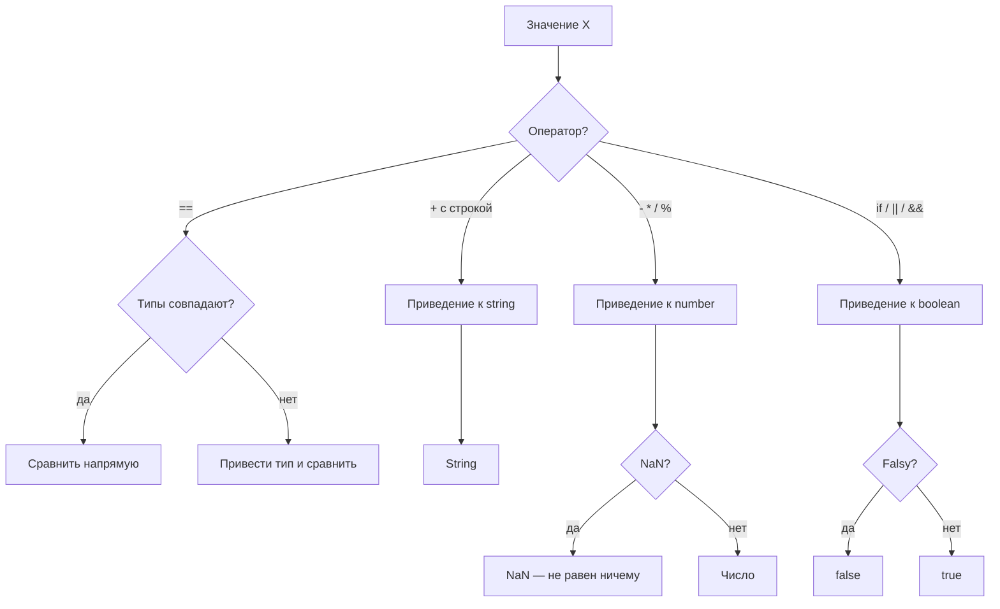

# Приведение типов в JavaScript

Приведение типов (type coercion) — автоматическое или явное преобразование значения одного типа в другой. В JavaScript оно бывает **явным** (explicit) и **неявным** (implicit).

## Явное приведение

Вызываешь функцию преобразования сам:

```js
Number('42')     // 42
Number('')       // 0
Number('abc')    // NaN
String(100)      // '100'
Boolean(0)       // false
Boolean([])      // true  (пустой массив — truthy!)
parseInt('3px')  // 3
```

## Неявное приведение

JavaScript сам приводит типы при операциях:

```js
'5' + 3       // '53'  (число → строка, затем конкатенация)
'5' - 3       // 2     (строка → число, затем вычитание)
'5' * '3'     // 15    (обе строки → числа)
true + 1      // 2     (true → 1)
false + 1     // 1     (false → 0)
null + 1      // 1     (null → 0)
undefined + 1 // NaN
```

> Оператор `+` с хотя бы одной строкой → конкатенация. Остальные арифметические операторы → число.

## == vs ===

`==` (нестрогое равенство) выполняет приведение перед сравнением:

```js
0 == false        // true  (false → 0)
0 == ''           // true  ('' → 0)
'' == false       // true
null == undefined // true  (специальный случай)
NaN == NaN        // false (NaN не равен ничему!)

// С === приведения нет:
0 === false       // false
null === undefined // false
```

**Правило:** используй `===` везде, кроме проверки `null == undefined`.

## Truthy и Falsy

Любое значение в boolean-контексте (`if`, `&&`, `||`) приводится к `true` или `false`.

**Falsy** (7 значений, всё остальное — truthy):

| Значение | Тип |
|---|---|
| `false` | boolean |
| `0`, `-0`, `0n` | number / bigint |
| `''`, `""` | string |
| `null` | null |
| `undefined` | undefined |
| `NaN` | number |

Сюрпризы: `[]`, `{}`, `'0'`, `'false'` — **truthy**!

## Схема



## Карточки
- В чём разница между == и === в JavaScript?
- Что вернёт `'5' + 3` и `'5' - 3`?
- Какие 7 значений являются falsy в JavaScript?
- Что такое явное и неявное приведение типов?
